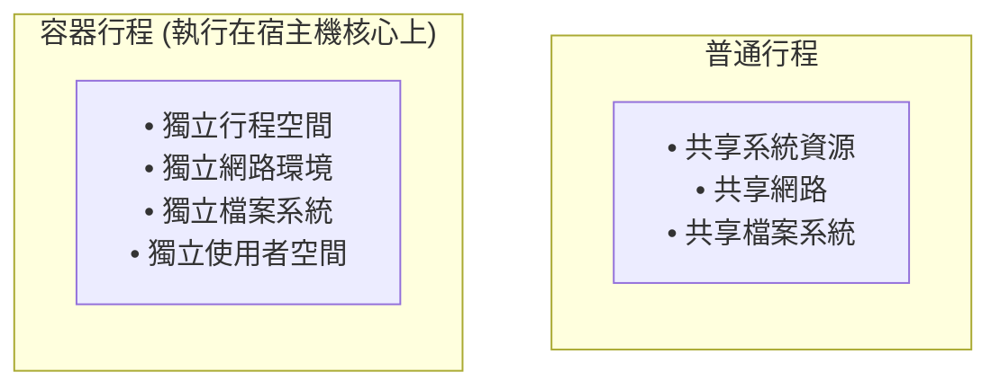
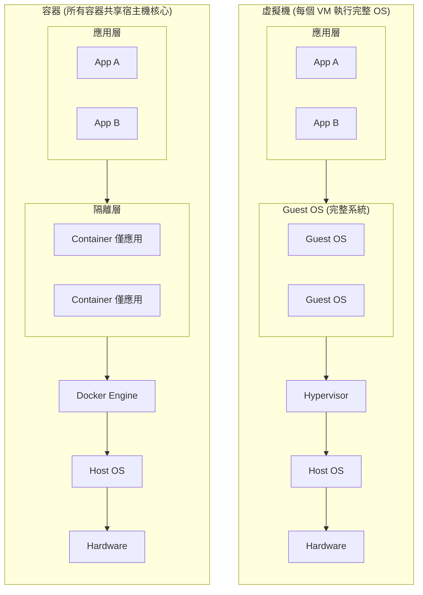
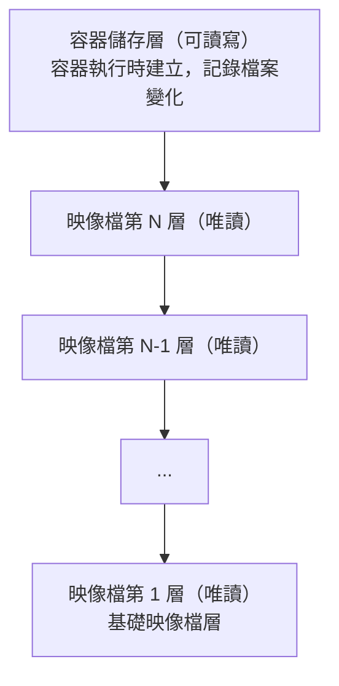
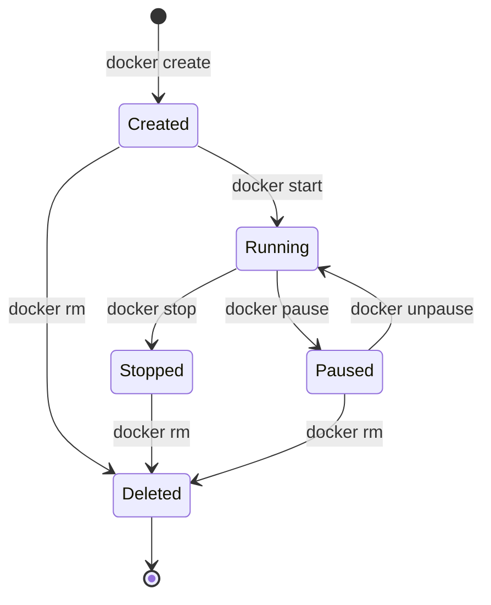

## 容器

容器是 Docker 技術的核心，是應用實際執行的載體。本節將從容器的本質、與虛擬機的區別、儲存層機制以及生命週期管理等方面，全面解析 Docker 容器。

### 一句話理解容器

> **容器是映像檔的執行實例。如果把映像檔比作程式，那麼容器就是行程。** 用物件導向程式設計的術語來說：**映像檔是類別 (Class)，容器是物件 (Instance)**。

- 一個映像檔可以建立多個容器
- 每個容器相互獨立，互不影響
- 容器可以被建立、啟動、停止、刪除、暫停

### 容器的本質

> 💡 筆者認為，理解這一點是理解 Docker 的關鍵：**容器的本質是一個特殊的行程**。


這種隔離主要透過 Linux 核心的 **Namespace** 實作，資源限制通常與 **cgroups** 配合。具體表現為：

- **行程空間**：容器看不到宿主機上的其他行程。
- **網路**：在預設網路模式下，容器通常擁有獨立的網路命名空間，並可分配獨立 IP；使用 `host` 或 `container:` 等模式時則例外。
- **檔案系統**：容器擁有獨立的 root 目錄。
- **使用者**：預設情況下，容器內的 `root` 仍是 `uid 0`，但通常只擁有受限 capabilities；如果啟用 `userns-remap` 或 rootless 等機制，還會進一步映射為宿主機上的低權限使用者。

### 容器 vs 虛擬機：核心區別

很多初學者會混淆容器和虛擬機。筆者用一張圖來說明：


| 特性 | 容器 | 虛擬機 |
|------|------|--------|
| **隔離級別** | 作業系統級 (Namespaces/cgroups) | 硬體虛擬化級 (Hypervisor) |
| **啟動時間** | 通常更快 | 通常更慢 |
| **資源佔用** | 通常更低 | 通常更高 |
| **執行開銷** | 通常更接近原生 | 通常有更高虛擬化開銷 |
| **核心** | 共享宿主機核心 | 各自獨立核心 |

### 容器的儲存層

理解容器的儲存層機制對於資料的持久化和映像檔的最佳化至關重要。本節將介紹容器的可寫層以及 Copy-on-Write 機制。

#### 映像檔層 + 容器層

當容器執行時，Docker 會在映像檔的唯讀層之上建立一個 **可寫層**（容器儲存層）：



#### Copy-on-Write：寫時複製

當容器需要修改映像檔層中的檔案時：

1. Docker 將該檔案 **複製** 到容器儲存層
2. 在容器層中進行修改
3. 原始映像檔層保持不變

```bash
讀取檔案：直接從映像檔層讀取（共享，高效）
修改檔案：複製到容器層，然後修改（只有這個容器能看到修改）
```

#### ⚠️ 容器儲存層的生命週期

> **筆者特別強調**：這是新手最容易踩的坑！**容器儲存層與容器生命週期綁定。容器刪除，資料就沒了！**

```bash
## 建立容器，寫入資料

$ docker run -it ubuntu bash
root@abc123:/# echo "important data" > /data.txt
root@abc123:/# exit

## 刪除容器

$ docker rm abc123

## 資料丟了！沒有任何辦法恢復！

```

#### 正確的資料持久化方式

按照 Docker 最佳實踐，容器儲存層應該保持 **無狀態**。需要持久化的資料應該使用：

| 方式 | 說明 | 適用情境 |
|------|------|---------|
| **[資料卷 (Volume) ](../data_management/volume.md)** | Docker 管理的儲存 | 資料庫、應用資料 |
| **[綁定掛載 (Bind Mount) ](../data_management/bind-mounts.md)** | 掛載宿主機目錄 | 開發時共享程式碼 |

```bash
## 使用資料卷（推薦）

$ docker run -v mydata:/var/lib/mysql mysql

## 使用綁定掛載

$ docker run -v /host/path:/container/path nginx
```
這些位置的讀寫 **會跳過容器儲存層**，直接寫入宿主機，效能更好，也不會隨容器刪除而遺失。

### 容器的生命週期

掌握容器的生命週期對於管理和除錯 Docker 應用非常重要。如圖 2-1 所示，這裡先聚焦最常見的建立、執行、暫停、停止和刪除流轉；Docker CLI 中還可能看到 `restarting`、`removing`、`dead` 等狀態。


圖 2-1：容器生命週期狀態流轉圖

常用生命週期命令如下：

```bash
## 建立並啟動容器（最常用）

$ docker run nginx

## 分步操作

$ docker create nginx    # 建立容器（不啟動）
$ docker start abc123    # 啟動容器

## 停止容器

$ docker stop abc123     # 優雅停止（傳送 SIGTERM，等待後傳送 SIGKILL）
$ docker kill abc123     # 強制停止（直接傳送 SIGKILL）

## 暫停/恢復（不常用，但有時有用）

$ docker pause abc123    # 暫停容器內所有行程
$ docker unpause abc123  # 恢復

## 刪除容器

$ docker rm abc123       # 刪除已停止的容器
$ docker rm -f abc123    # 強制刪除執行中的容器
```

### 容器與行程的關係

> **核心概念**：容器的生命週期 = 主行程 (PID 1) 的生命週期

```bash
## 主行程執行，容器執行

## 主行程退出，容器停止

```
這就是為什麼：

```bash
## 這個容器會立即退出（bash 沒有輸入就退出了）

$ docker run ubuntu

## 這個容器會持續執行（官方 nginx 映像檔讓 nginx 在前台執行）

$ docker run nginx
```
官方 `nginx` 映像檔預設使用 `nginx -g 'daemon off;'`，讓主行程保持在前台執行，這樣容器才會持續處於執行狀態。

詳細解釋請參考[常駐執行](../container/daemon.md)章節。

### 容器的隔離性

Docker 容器透過以下 Namespace 實作隔離：

| Namespace | 隔離內容 | 效果 |
|-----------|---------|------|
| **PID** | 行程 ID | 容器內 PID 1 是應用行程，看不到宿主機其他行程 |
| **NET** | 網路 | 獨立的網路棧、IP 位址、埠號 |
| **MNT** | 檔案系統 | 獨立的根目錄和掛載點 |
| **UTS** | 主機名 | 獨立的主機名和網域名稱 |
| **IPC** | 行程間通訊 | 獨立的訊號量、訊息佇列 |
| **USER** | 使用者 | 獨立的使用者和群組 ID |

> 想深入了解？請閱讀[底層實作 - 命名空間](../underly/namespace.md)。
