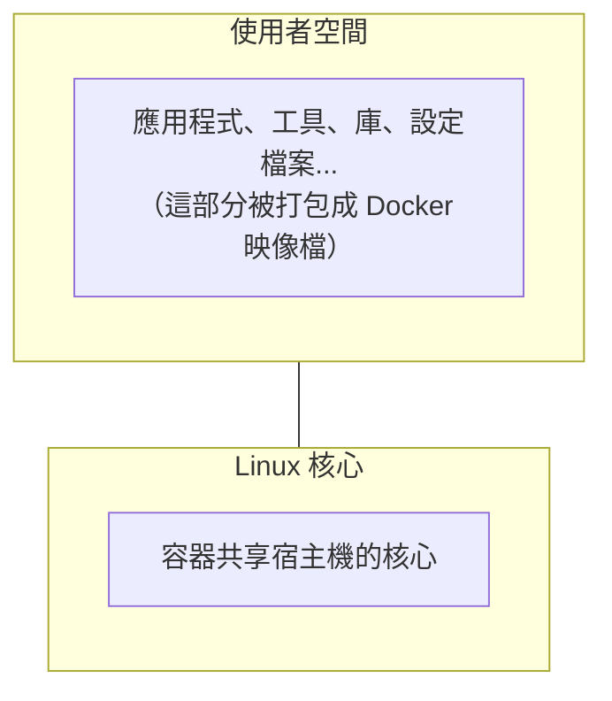
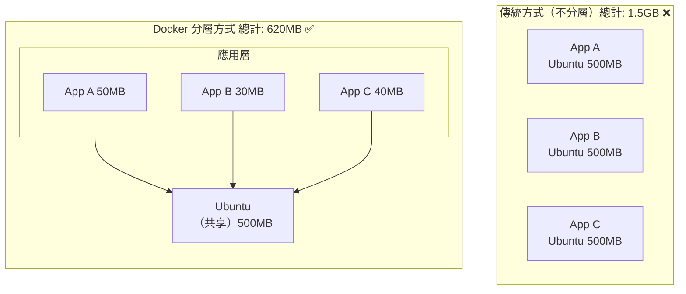
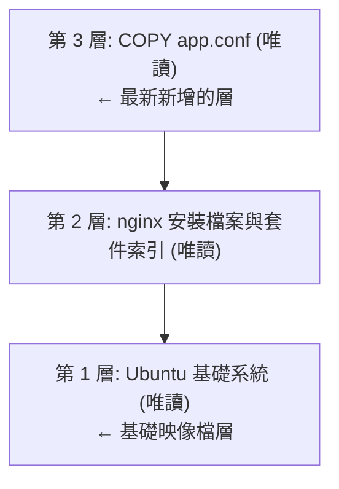

## 映像檔

> **版本說明**：本節範例基於 Docker v29.x 編寫。範例中使用的映像檔標籤（如 `ubuntu:24.04`、`nginx:latest`）為演示用途，建議查閱 [Docker Hub](https://hub.docker.com) 或相應映像檔的官方頁面確認最新可用版本。

Docker 映像檔作為容器執行的基石，其設計理念和實作機制至關重要。本節將深入探討映像檔的本質、與作業系統的關係、內容構成以及核心的分層儲存機制。

### 一句話理解映像檔

> **Docker 映像檔是一個唯讀的模板，包含了執行應用所需的一切：程式碼、執行時期、庫、環境變數和設定檔案。** 如果用一個類比：**映像檔就像是一張光碟或 ISO 檔案**。你可以用同一張光碟在不同電腦上安裝系統，而光碟本身不會被修改。同樣，一個映像檔可以建立多個容器，而映像檔本身保持不變。

### 映像檔與作業系統的關係

我們都知道，作業系統分為 **核心** 和 **使用者空間**：


對於 Linux 而言，核心啟動後會掛載 `root` 檔案系統來提供使用者空間支援。**Docker 映像檔** 本質上就是一個 `root` 檔案系統。

例如，官方映像檔 `ubuntu:24.04` 包含了一套完整的 Ubuntu 24.04 最小系統的 root 檔案系統——但 **不包含 Linux 核心**（因為容器共享宿主機的核心）。

### 映像檔包含什麼？

Docker 映像檔是一個特殊的檔案系統，包含：

| 內容類型 | 範例 |
|---------|------|
| **程式檔案** | 應用二進位檔案、Python/Node 直譯器 |
| **庫檔案** | libc、OpenSSL、各種相依庫 |
| **設定檔案** | nginx.conf、my.cnf 等 |
| **環境變數** | PATH、LANG 等預設值 |
| **中繼資料** | 啟動命令、暴露埠號、資料卷定義 |

**關鍵特性**：

- ✅ 映像檔是 **唯讀** 的
- ✅ 映像檔 **不包含** 動態資料
- ✅ 映像檔建立後 **內容不會改變**

### 分層儲存：映像檔的核心設計

映像檔的分層儲存機制是 Docker 最具創新性的特性之一。透過 Union FS 技術，Docker 能夠高效地建立和管理映像檔。

#### 為什麼需要分層？

筆者認為，分層儲存是 Docker 最巧妙的設計之一。

假設你有三個應用，都基於 Ubuntu 執行：



#### 分層是如何工作的？

筆者用一個更貼近最佳實踐的 Dockerfile 來解釋分層：

```docker
FROM ubuntu:24.04                              # 第 1 層：基礎系統（約 78MB）
RUN apt-get update && apt-get install -y nginx # 第 2 層：更新索引並安裝 nginx
COPY app.conf /etc/nginx/                      # 第 3 層：複製設定檔案
```
這裡特意把 `apt-get update` 和 `apt-get install` 放在同一個 `RUN` 裡，避免建立快取導致套件索引過期。

建立後的映像檔結構：


每一層的特點：

- **唯讀**：建立完成後不可修改
- **可共享**：多個映像檔可以共享相同的層
- **有快取**：未變化的層不會重新建立

#### 分層儲存的「陷阱」

> ⚠️ **筆者特別提醒**：理解這一點可以幫你避免建立出臃腫的映像檔。**關鍵原理**：每一層的檔案變化會被記錄，但 **刪除操作只是標記，不會真正減小映像檔體積**。

```docker
## 錯誤示範 ❌

FROM ubuntu:24.04
RUN apt-get update
RUN apt-get install -y build-essential  # 安裝編譯工具（約 200MB）
RUN make && make install                  # 編譯應用
RUN apt-get remove build-essential        # 試圖刪除編譯工具

## 結果：映像檔仍然包含 200MB 的編譯工具！
```
```docker
## 正確做法 ✅

FROM ubuntu:24.04
RUN apt-get update && \
    apt-get install -y build-essential && \
    make && make install && \
    apt-get remove -y build-essential && \
    apt-get autoremove -y && \
    rm -rf /var/lib/apt/lists/*

## 在同一層完成安裝、使用、清理

```

### 查看映像檔的建立歷史

```bash
## 查看映像檔的歷史（每層的建立記錄）

$ docker history nginx:latest

IMAGE          CREATED       CREATED BY                                      SIZE
a6bd71f48f68   2 weeks ago   CMD ["nginx" "-g" "daemon off;"]                0B
<missing>      2 weeks ago   STOPSIGNAL SIGQUIT                              0B
<missing>      2 weeks ago   EXPOSE map[80/tcp:{}]                           0B
<missing>      2 weeks ago   ENTRYPOINT ["/docker-entrypoint.sh"]            0B
<missing>      2 weeks ago   COPY 30-tune-worker-processes.sh /docker-ent…   4.62kB
...
```
需要注意：`docker history` 展示的是映像檔的建立歷史。像 `CMD`、`ENTRYPOINT`、`EXPOSE`、`STOPSIGNAL` 這類 `0B` 項主要是映像檔設定的中繼資料，並不等同於新增了可見的檔案系統內容；真正佔用空間的通常是 `RUN`、`COPY`、`ADD` 等帶來的檔案變化。

### 映像檔的標識

Docker 映像檔有多種標識方式：

#### 1. 映像檔名稱和標籤

格式：`[倉庫位址/]倉庫名[:標籤]`

```bash
## 完整格式

registry.example.com/myproject/myapp:v1.2.3

## 簡寫（使用 Docker Hub）

nginx:1.28
ubuntu:24.04

## 省略標籤（預設使用 latest）

nginx  # 等同於 nginx:latest
```

#### 2. 映像檔 ID：Content-Addressable 標識

每個映像檔有一個基於內容計算的唯一 ID：

```bash
$ docker images
REPOSITORY   TAG       IMAGE ID       CREATED        SIZE
nginx        latest    a6bd71f48f68   2 weeks ago    187MB
ubuntu       24.04     ca2b0f26964c   3 weeks ago    78.1MB
```

#### 3. 映像檔摘要

更精確的標識，基於映像檔內容的 SHA256 雜湊：

```bash
$ docker images --digests
REPOSITORY  TAG     DIGEST                                                                    IMAGE ID
nginx       latest  sha256:6db391d1c0cfb30588ba0bf72ea999404f2764184d8b8d10d89e8a9c6... a6bd71f48f68
```
> 💡 筆者建議：在生產環境使用映像檔摘要而非標籤，因為標籤可以被覆蓋，但摘要是不可變的。

### 映像檔的來源

Docker 映像檔可以透過以下方式取得：

| 方式 | 說明 | 範例 |
|------|------|------|
| **從 Registry 拉取** | 最常用的方式 | `docker pull nginx` |
| **從 Dockerfile 建立** | 自訂映像檔 | `docker build -t myapp .` |
| **從容器提交** | 儲存容器狀態（不推薦）| `docker commit` |
| **從檔案匯入** | 離線傳輸 | `docker load < image.tar` |
