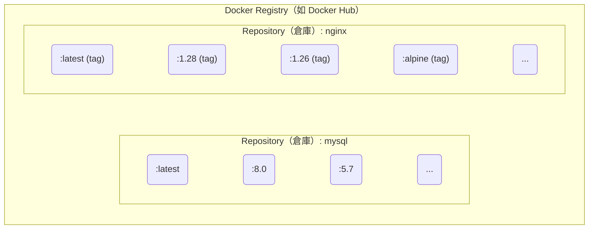

## 倉庫

> **版本說明**：本節範例基於 Docker v29.x 和常見映像檔版本編寫。範例中的版本號（如 `nginx:1.28`、`mysql:8.4`、`mysql:5.7` 等）為演示用途。實際使用時請存取 [Docker Hub 官方頁面](https://hub.docker.com) 或相應映像檔的發布頁確認最新可用版本和標籤。

Docker Registry 是映像檔分發和管理的核心元件。本節將介紹 Registry 的基本概念、公共和私有服務的選擇，以及映像檔的安全管理。

### 一句話理解 Registry

> **Docker Registry 是儲存和分發 Docker 映像檔的服務，類似於程式碼的 GitHub 或套件管理的 npm。**

映像檔建立完成後，可以在目前機器上執行。但如果需要在其他伺服器上使用這個映像檔，就需要一個集中的儲存和分發服務——這就是 Docker Registry。

### 核心概念

要熟練使用 Docker Registry，首先需要理清它與倉庫 (Repository)、標籤 (Tag) 之間的關係。

#### Registry、倉庫、標籤的關係

Docker Registry 中可以包含多個 Repository，每個 Repository 可以包含多個 Tag。如圖 2-2 所示，它們之間具有清晰的層級關係。


圖 2-2：Registry、Repository 與 Tag 的層級關係

相關基本概念具體如下：

| 概念 | 說明 | 範例 |
|------|------|------|
| **Registry** | 儲存映像檔的服務 | Docker Hub、ghcr.io |
| **Repository（倉庫）** | 同一軟體的映像檔集合 | `nginx`、`mysql`、`mycompany/myapp` |
| **Tag（標籤）** | 倉庫內的版本標識 | `latest`、`1.28`、`alpine` |

#### 映像檔的完整名稱

一個完整的 Docker 映像檔名稱由 Registry 位址、使用者名稱/組織名、倉庫名和標籤組成。了解其結構有助於我們更準確地定位映像檔。基本格式如下：

```bash
[registry 位址/][使用者名稱/]倉庫名[:標籤]
```
範例：

```bash
## 完整格式

registry.example.com/mycompany/myapp:v1.2.3
│                    │         │     │
│                    │         │     └── 標籤
│                    │         └── 倉庫名
│                    └── 使用者名稱/組織名
└── Registry 位址

## Docker Hub 官方映像檔（省略 registry 和使用者名稱）

nginx:1.28
ubuntu:24.04

## Docker Hub 使用者映像檔

jwilder/nginx-proxy:latest

## 其他 Registry

ghcr.io/username/myapp:v1.0
us-west1-docker.pkg.dev/my-project/my-repo/myapp:v1.0
```
> 💡 **筆者提示**：如果不指定 Registry 位址，預設使用 Docker Hub。如果不指定標籤，預設使用 `latest`。

### 公共 Registry 服務

公共 Registry 服務為開發者提供了便捷的映像檔取得途徑。其中最著名的是 Docker Hub。

#### 預設的 Docker Hub

[Docker Hub](https://hub.docker.com/) 是最大的公共 Registry，也是 Docker 的預設 Registry。

**特點**：

- 擁有大量[官方映像檔](https://hub.docker.com/search?q=&type=image&image_filter=official)（nginx、mysql、redis 等）
- 免費帳戶可以建立公開倉庫
- 免費個人帳戶可建立 1 個私有倉庫；更高套餐支援更多私有倉庫

```bash
## 從 Docker Hub 拉取映像檔

$ docker pull nginx              # 官方映像檔
$ docker pull bitnami/redis      # 第三方映像檔

## 推送映像檔到 Docker Hub

$ docker login
$ docker push username/myapp:v1.0
```

#### 其他公共 Registry

除了 Docker Hub，還有以下幾個常見的公共 Registry：

| Registry | 位址 | 說明 |
|----------|------|------|
| **GitHub Container Registry** | ghcr.io | GitHub 提供，與 GitHub Actions 整合好 |
| **Google Artifact Registry** | LOCATION-docker.pkg.dev | Google Cloud 目前推薦；也支援遷移後的 `gcr.io` 相容網域名稱 |
| **Quay.io** | quay.io | Red Hat 提供 |
| **阿里雲容器映像檔服務** | registry.cn-*.aliyuncs.com | 大陸存取快 |
| **騰訊雲容器映像檔服務** | ccr.ccs.tencentyun.com | 大陸存取快 |

Google 的 Container Registry 已廢棄並完成下線，目前應優先使用 Artifact Registry；如果已經完成遷移，部分 `gcr.io` 網域名稱請求會被相容到 Artifact Registry。

### 映像檔加速器

由於網路原因，在大陸直接存取 Docker Hub 可能會很慢。可以設定 **映像檔加速器** (Registry Mirror) 來加速下載。設定範例如下：

```jsonc
// /etc/docker/daemon.json
{
  "registry-mirrors": [
    "https://your-accelerator-url"
  ]
}
```
詳細設定方法請參考[映像檔加速器](../install/mirror.md)章節。

> ⚠️ **筆者提醒**：映像檔加速器的可用性經常變化，使用前建議先測試是否可用。

### 私有 Registry

出於安全和隱私的考慮，企業往往需要搭建自己的私有 Registry。以下是幾種常見的搭建方案。

#### 官方 Registry 映像檔

Docker 官方提供了 [registry](https://hub.docker.com/_/registry/) 映像檔，可以快速搭建私有 Registry：

```bash
## 啟動一個本地 Registry

$ docker run -d -p 5000:5000 --name registry registry:2

## 推送映像檔到本地 Registry

$ docker tag myapp:v1.0 localhost:5000/myapp:v1.0
$ docker push localhost:5000/myapp:v1.0

## 從本地 Registry 拉取

$ docker pull localhost:5000/myapp:v1.0
```

#### 企業級解決方案

官方 Registry 功能較為基礎，企業環境常用以下方案：

| 方案 | 特點 |
|------|------|
| **[Harbor](https://goharbor.io/)** | CNCF 專案，功能全面（使用者管理、漏洞掃描、映像檔簽名）|
| **[Nexus Repository](../repository/nexus3.md)** | 支援多種製品類型（Docker、Maven、npm 等）|
| **雲廠商服務** | 阿里雲 ACR、騰訊雲 TCR、AWS ECR 等 |

筆者建議：

- 小團隊：可以先用官方 Registry，夠用即可
- 中大型團隊：推薦 Harbor，功能完善且開源免費
- 已使用雲服務：直接用雲廠商的 Registry 服務更省心

### 映像檔的推送和拉取

掌握映像檔的推送 (Push) 和拉取 (Pull) 是使用 Docker Registry 的基本功。

#### 完整工作流程

如圖 2-3 所示，映像檔從開發環境建立後推送到 Registry，再由生產環境拉取並執行。

```bash
開發者機器                    Registry                    生產伺服器
     │                           │                             │
     │  docker build             │                             │
     │  建立映像檔                │                             │
     │                           │                             │
     │  docker push ─────────────▶                             │
     │  推送映像檔                │  儲存映像檔                 │
     │                           │                             │
     │                           │  ◀───────────── docker pull │
     │                           │                  拉取映像檔  │
     │                           │                             │
     │                           │                  docker run │
     │                           │                  執行容器    │
```
圖 2-3：映像檔建立、推送與拉取流程

#### 常用命令

```bash
## 登入 Registry

$ docker login                      # 登入 Docker Hub
$ docker login registry.example.com # 登入其他 Registry

## 拉取映像檔

$ docker pull nginx:1.28

## 標記映像檔（準備推送）

$ docker tag myapp:latest registry.example.com/myteam/myapp:v1.0

## 推送映像檔

$ docker push registry.example.com/myteam/myapp:v1.0

## 登出

$ docker logout
```

### 映像檔的安全性

在使用公共映像檔或維護私有映像檔時，安全性是不容忽視的重要環節。

#### 使用官方映像檔

Docker Hub 的[官方映像檔](https://hub.docker.com/search?q=&type=image&image_filter=official)（標有「Official Image」標識）經過 Docker 團隊審核，相對更安全。範例如下：

```bash
## 官方映像檔範例

nginx          # ✅ 官方
mysql          # ✅ 官方
redis          # ✅ 官方

## 第三方映像檔（需要自行評估可信度）

bitnami/redis  # ⚠️ 需要評估
someuser/myapp # ⚠️ 需要評估
```

#### 映像檔簽名

目前更推薦使用 Sigstore / Notation 體系進行映像檔簽名與驗證。`Docker Content Trust (DCT)` 已被正式退役：自 Docker Engine 29.0 起 DCT 已從 Docker CLI 中移除（`docker trust` 子命令不再隨 CLI 發布，僅能作為獨立外掛自行建立；`docker push`、`docker pull`、`docker build`、`docker run` 等命令上的 `--disable-content-trust` 選項雖仍可解析，但已標記為廢棄且不再有實際作用），Docker 官方的 Notary v1 服務 `notary.docker.io` 也將於 2026 年 12 月 8 日完全關閉；最早一批 DCT 簽名憑證自 2025 年 8 月 8 日起已開始過期，Docker 建議映像檔發布者遷移到 Sigstore、Notation 等方案。不建議把 DCT 作為新專案方案。

> 注意：Cosign 預設會把簽名推送回映像檔所在倉庫，請使用你有推送權限的映像檔位址。

```bash
## 準備一個你有寫權限的映像檔位址
$ export IMAGE=<你的倉庫名>/nginx:1.28
$ docker pull nginx:1.28
$ docker tag nginx:1.28 $IMAGE
$ docker push $IMAGE

## 產生簽名金鑰（會產生 cosign.key / cosign.pub）
$ cosign generate-key-pair

## 使用 Cosign 簽名與驗證
$ cosign sign --key cosign.key $IMAGE
$ cosign verify --key cosign.pub $IMAGE
```

#### 漏洞掃描

```bash
## 使用 Docker Scout 掃描映像檔漏洞

$ docker scout cves nginx:latest

## 使用 Trivy（開源工具）

$ trivy image nginx:latest
```
