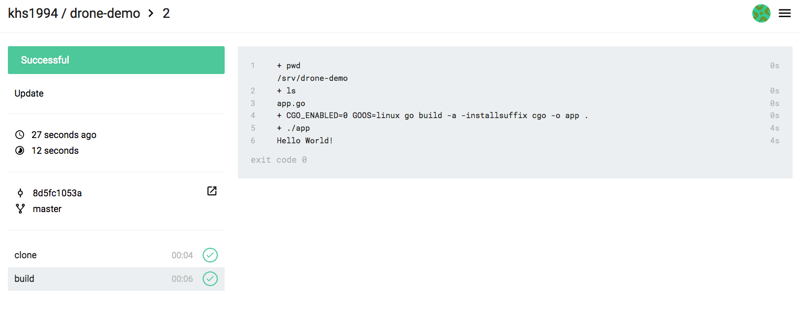

## Drone

基於 `Docker` 的 `CI/CD` 工具 `Drone`，所有編譯、測試的流程都在容器中進行。

開發者只需在專案中包含 `.drone.yml` 檔案，將程式碼推送到 git 倉庫，`Drone` 就能夠自動化地進行編譯、測試、發布。

本小節以 `GitHub` + `Drone` 來演示 `Drone` 的工作流程。
當然在實際開發過程中，你的程式碼也許不在 GitHub 託管，那麼你可以嘗試使用 `Gogs` + `Drone` 來進行 CI/CD。

> 安全提示：Docker runner 如果掛載宿主機 `/var/run/docker.sock`，流水線就具備近似宿主機 root 的控制能力。下面設定只適合可信程式碼、單租戶、本地演示環境；生產環境應使用隔離的臨時 runner/虛擬機器、Kubernetes runner、rootless 方案或更嚴格的權限邊界，並為不同專案隔離密鑰。

### 關聯專案

在 GitHub 新建一個名為 `drone-demo` 的倉庫。

打開我們已經部署好的 Drone 網站或者 [Drone Cloud](https://cloud.drone.io)，
使用 GitHub 帳號登入，在介面中關聯剛剛新建的 `drone-demo` 倉庫。

### 編寫專案原始碼

初始化一個 git 倉庫：

```bash
mkdir drone-demo
cd drone-demo

git init

git remote add origin git@github.com:username/drone-demo.git
```
這裡以一個簡單的 `Go` 程式為例，該程式輸出 `Hello World!`

編寫 `app.go` 檔案：

```go
package main

import "fmt"

func main() {
    fmt.Printf("Hello World!\n")
}
```
編寫 `.drone.yml` 檔案：

```yaml
kind: pipeline
type: docker
name: build

steps:
  - name: build
    image: golang:alpine
    pull: if-not-exists
    environment:
      KEY: VALUE
    commands:
      - echo $KEY
      - pwd
      - ls
      - CGO_ENABLED=0 GOOS=linux go build -a -installsuffix cgo -o app .
      - ./app

trigger:
  branch:
    - master
```
現在目錄結構如下：

```bash
.
├── .drone.yml
└── app.go
```

### 推送專案原始碼到 GitHub

```bash
git add .

git commit -m "test drone ci"

git push origin master
```

### 查看專案建立過程及結果

打開我們部署好的 `Drone` 網站或者 Drone Cloud，即可看到建立結果。



當然我們也可以把建立結果上傳到 GitHub、Docker Registry、
雲服務商提供的物件儲存，或者生產環境中。
