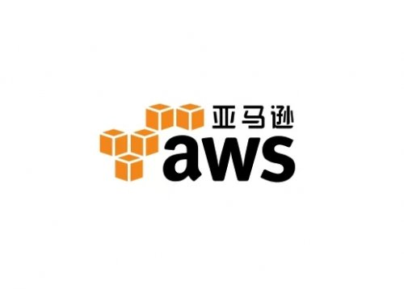
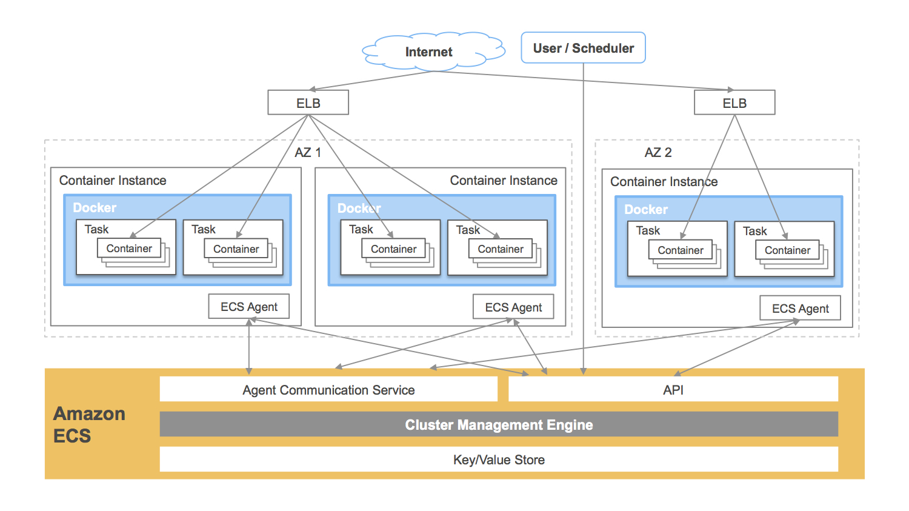

## 16.4 亞馬遜雲

如圖 16-5 所示，AWS 是全球主流雲服務平台之一。

圖 16-5：AWS 標識

[AWS](https://www.amazonaws.cn)，即 Amazon Web Services，是亞馬遜 (Amazon) 公司的 IaaS 和 PaaS 平台服務。AWS 提供了一整套基礎設施和應用程式服務，使使用者幾乎能夠在雲中運行一切應用程式：從企業應用程式和大資料專案，到社交遊戲和移動應用程式。AWS 面向使用者提供包括彈性計算、儲存、資料庫、應用程式在內的一整套雲端運算服務，能夠幫助企業降低 IT 投入成本和維護成本。

在容器領域，AWS 目前主流能力可以按場景分為四類：

1. `Amazon EKS`：託管 Kubernetes 控制平面，適合標準雲原生工作負載。
2. `Amazon ECS`：AWS 原生容器編排服務，適合深度整合 AWS 生態 (IAM、ALB、CloudWatch) 場景。
3. `AWS Fargate`：無伺服器容器執行時期，可與 EKS/ECS 結合使用，減少節點維運。
4. `Amazon ECR`：映像檔倉庫服務，提供私有映像檔管理、掃描與存取控制。

實務建議：

* 團隊已具備 Kubernetes 經驗，優先選擇 EKS；
* 追求更低維運複雜度且業務主要運行在 AWS，可優先 ECS + Fargate；
* 無論編排方案如何，都建議使用 ECR 統一管理映像檔生命週期。

圖 16-6：AWS 容器服務示意圖
