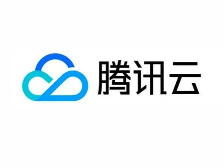
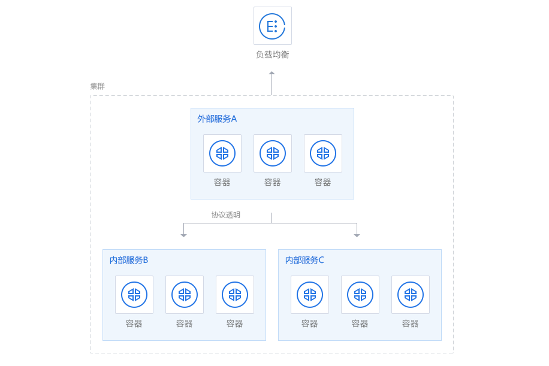

## 16.2 騰訊雲

騰訊雲容器服務 TKE 是騰訊雲提供的 Kubernetes 託管服務，適合把容器化應用部署到雲上。官方文件見 [騰訊雲容器服務](https://intl.cloud.tencent.com/document/product/457)。



圖 16-1：騰訊雲標識

下面的示例只保留建立集群、部署應用、管理映像檔和設定加速器這幾類最常見操作。



圖 16-2：騰訊雲容器服務示意圖

### 騰訊雲容器服務：TKE 簡介

騰訊雲容器服務 (TKE, Tencent Kubernetes Engine) 是一款容器編排平台，基於原生 Kubernetes 提供，支持自動擴展、負載均衡、多可用區高可用等企業級功能。TKE 幫助開發者快速部署和管理容器化應用，消除集群維運的複雜度。

### 基本使用步驟

#### 1. 建立集群

登入騰訊雲控制台，進入容器服務模組：

- 選擇 “建立集群”，設定集群名稱、地域和網路
- 選擇節點設定（雲伺服器規格和數量）
- 設定 Kubernetes 版本和安全群組
- 完成建立後獲得集群 kubeconfig 檔案

```bash
# 下載 kubeconfig 檔案後，設定本地環境
export KUBECONFIG=/path/to/kubeconfig.yaml
kubectl cluster-info
```

#### 2. 部署容器應用

建立 Deployment 部署應用：

```yaml
apiVersion: apps/v1
kind: Deployment
metadata:
  name: nginx-app
spec:
  replicas: 3
  selector:
    matchLabels:
      app: nginx
  template:
    metadata:
      labels:
        app: nginx
    spec:
      containers:
      - name: nginx
        image: nginx:latest
        ports:
        - containerPort: 80
```
應用設定檔案：

```bash
kubectl apply -f deployment.yaml
kubectl get pods
kubectl get svc
```

#### 3. 管理映像檔

使用騰訊雲容器映像檔服務 (TCR) 儲存和分發私有映像檔：

```bash
# 登入騰訊雲映像檔倉庫
docker login ccr.ccs.tencentyun.com -u <username>

# 標記本地映像檔
docker tag my-app:latest ccr.ccs.tencentyun.com/namespace/my-app:latest

# 推送映像檔到騰訊雲
docker push ccr.ccs.tencentyun.com/namespace/my-app:latest
```

### 騰訊雲 Docker 映像檔加速器設定

如果你的帳號開通了映像檔加速器，可以把控制台給出的位址寫入 Docker 設定。

#### Linux 系統設定

編輯 `/etc/docker/daemon.json` 檔案（如果不存在則建立）：

```bash
# 建立或編輯設定檔案
sudo mkdir -p /etc/docker
sudo nano /etc/docker/daemon.json
```
加入以下內容：

```json
{
  "registry-mirrors": [
    "https://mirror.ccs.tencentyun.com"
  ],
  "insecure-registries": []
}
```
重新啟動 Docker 服務：

```bash
sudo systemctl daemon-reload
sudo systemctl restart docker
```
驗證設定：

```bash
docker info | grep -A 5 "Registry Mirrors"
```

#### Windows/Mac 設定

對於 Docker Desktop，在設定介面中打開 `Docker Engine`，把上述 `registry-mirrors` 欄位寫入 JSON 後重新啟動即可。

### 騰訊雲容器映像檔服務：TCR

TCR 提供私有映像檔倉庫、存取控制和映像檔分發能力。一個最小示例如下：

```bash
# 登入到騰訊雲 TCR
docker login ccr.ccs.tencentyun.com --username <username>

# 建立並推送映像檔
docker build -t my-app:v1.0 .
docker tag my-app:v1.0 ccr.ccs.tencentyun.com/my-namespace/my-app:v1.0
docker push ccr.ccs.tencentyun.com/my-namespace/my-app:v1.0
```

#### TKE 集群中使用 TCR 映像檔

設定映像檔拉取憑證後，在 Deployment 中直接引用 TCR 映像檔。Secret 必須建立在使用它的 namespace 中；下面示例使用 `default` namespace。

```bash
$ kubectl create secret docker-registry tcr-secret \
    --docker-server=ccr.ccs.tencentyun.com \
    --docker-username=<username> \
    --docker-password=<token-or-password> \
    --namespace=default
```

> 安全提示：在命令列直接輸入密碼或 token 可能進入 shell 歷史紀錄。生產環境可先 `docker login`，再基於受保護的 `~/.docker/config.json` 建立 `kubernetes.io/dockerconfigjson` Secret，或使用雲廠商提供的託管憑證整合。

```yaml
apiVersion: apps/v1
kind: Deployment
metadata:
  name: my-app-deployment
  namespace: default
spec:
  replicas: 3
  selector:
    matchLabels:
      app: my-app
  template:
    metadata:
      labels:
        app: my-app
    spec:
      imagePullSecrets:
      - name: tcr-secret
      containers:
      - name: my-app
        image: ccr.ccs.tencentyun.com/my-namespace/my-app:v1.0
        ports:
        - containerPort: 8080
        resources:
          requests:
            memory: "256Mi"
            cpu: "100m"
          limits:
            memory: "512Mi"
            cpu: "500m"
```
