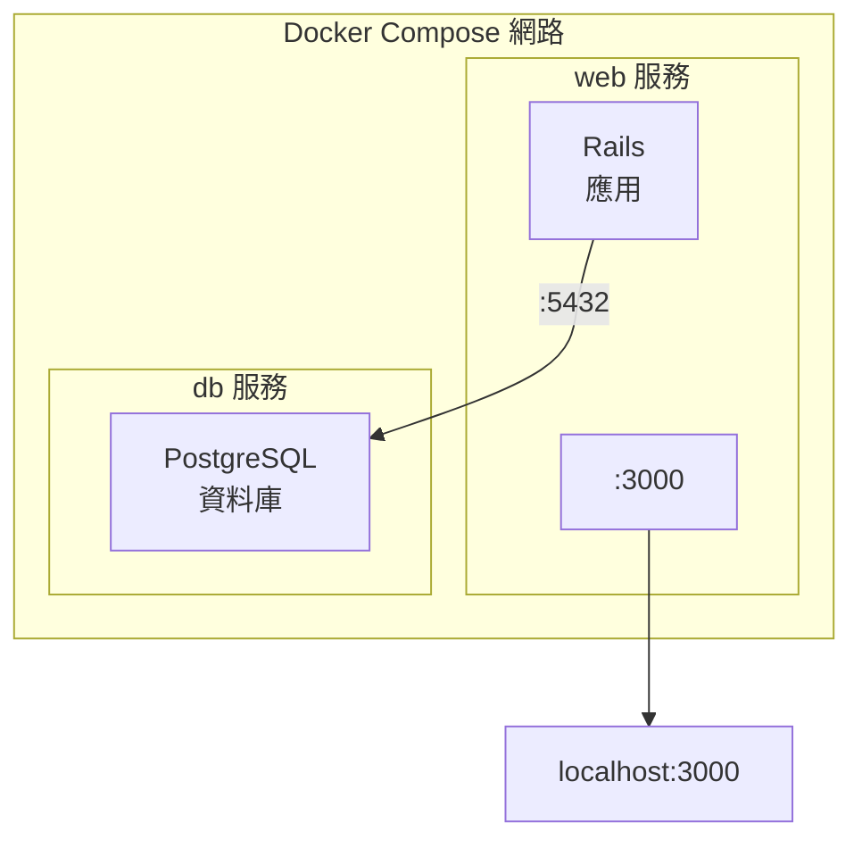

## 實戰 Rails

> 本小節內容適合 Ruby 開發人員閱讀。

> **版本說明**：本範例使用以下映像檔版本：
> - Ruby：3.2（可替換為其他 3.x 版本）
> - PostgreSQL：16（可替換為其他 16.x、15.x 等版本）
> - Rails：~> 7.1（可根據專案需求調整）

本節使用 Docker Compose 設定並執行一個 **Rails + PostgreSQL** 應用。

### 架構概覽

如圖 11-2 所示，Rails 與 PostgreSQL 在同一 Compose 網路中協同工作。


圖 11-2：Rails + PostgreSQL 的 Compose 架構

### 準備工作

建立專案目錄：

```bash
$ mkdir rails-docker && cd rails-docker
```
需要建立三個檔案：`Dockerfile`、`Gemfile` 和 `compose.yaml`。

### 步驟 1：建立 Dockerfile

```docker
FROM ruby:3.2

## 安裝系統依賴

RUN apt-get update -qq && \
    apt-get install -y build-essential libpq-dev nodejs && \
    rm -rf /var/lib/apt/lists/*

## 設定工作目錄

WORKDIR /myapp

## 先複製 Gemfile，利用快取加速建立

COPY Gemfile /myapp/Gemfile
COPY Gemfile.lock /myapp/Gemfile.lock
RUN bundle install

## 複製應用程式碼

COPY . /myapp
```
**設定說明**：

| 指令 | 作用 |
|------|------|
| `build-essential` | 編譯原生擴展所需 |
| `libpq-dev` | PostgreSQL 客戶端庫 |
| `nodejs` | Rails Asset Pipeline 需要 |
| 先複製 Gemfile | 只有依賴變化時才重新 `bundle install` |

### 步驟 2：建立 Gemfile

建立一個初始的 `Gemfile`，稍後會被 `rails new` 覆蓋：

```ruby
source 'https://rubygems.org'
gem 'rails', '~> 7.1'
```
建立空的 `Gemfile.lock`：

```bash
$ touch Gemfile.lock
```

### 步驟 3：建立 compose.yaml

設定如下。下面為了本地練習使用環境變數佔位；不要把真實資料庫密碼寫進 `compose.yaml`、`.env` 或 Git，生產環境應使用 Compose secrets、Rails credentials 或平台金鑰管理。

```yaml
services:
  db:
    image: postgres:16
    environment:
      POSTGRES_PASSWORD: ${POSTGRES_PASSWORD:?set POSTGRES_PASSWORD}
    volumes:
      - postgres_data:/var/lib/postgresql/data
    healthcheck:
      test: ["CMD-SHELL", "pg_isready -U postgres"]
      interval: 5s
      timeout: 5s
      retries: 5

  web:
    build: .
    command: bash -c "rm -f tmp/pids/server.pid && bundle exec rails s -p 3000 -b '0.0.0.0'"
    volumes:
      - .:/myapp
    ports:
      - "3000:3000"
    depends_on:
      db:
        condition: service_healthy
    environment:
      DATABASE_URL: postgres://postgres:${POSTGRES_PASSWORD:?set POSTGRES_PASSWORD}@db:5432/myapp_development

volumes:
  postgres_data:
```
**設定詳解**：

| 設定項 | 說明 |
|--------|------|
| `rm -f tmp/pids/server.pid` | 清理上次異常退出留下的 PID 檔案 |
| `volumes: .:/myapp` | 掛載程式碼目錄，支援熱更新 |
| `depends_on` + `condition` | 等待資料庫健康檢查透過後再啟動 |
| `DATABASE_URL` | Rails 12-factor 風格的資料庫設定 |

### 步驟 4：產生 Rails 專案

使用 `docker compose run` 產生專案骨架：

```bash
$ docker compose run --rm web rails new . --force --database=postgresql --skip-bundle
```
**命令解釋**：

- `--rm`：執行後刪除臨時容器
- `--force`：覆蓋已存在的檔案
- `--database=postgresql`：設定使用 PostgreSQL
- `--skip-bundle`：暫不安裝依賴（稍後統一安裝）

產生的目錄結構：

```bash
$ ls
Dockerfile       Gemfile          Rakefile         config           lib              tmp
Gemfile.lock     README.md        app              config.ru        log              vendor
compose.yaml     bin              db               public

```
> ⚠️ **Linux 使用者**：如遇許可權問題，執行 `sudo chown -R $USER:$USER .`

### 步驟 5：重新建立映像檔

由於產生了新的 Gemfile，需要重新建立映像檔以安裝完整依賴：

```bash
$ docker compose build
```

### 步驟 6：設定資料庫連線

修改 `config/database.yml`：

```yaml
default: &default
  adapter: postgresql
  encoding: unicode
  pool: <%= ENV.fetch("RAILS_MAX_THREADS") { 5 } %>
  url: <%= ENV['DATABASE_URL'] %>

development:
  <<: *default

test:
  <<: *default
  database: myapp_test

production:
  <<: *default
```
> 💡 使用 `DATABASE_URL` 環境變數設定資料庫，符合 12-factor 應用原則，便於在不同環境間切換。

### 步驟 7：啟動應用

```bash
$ docker compose up
```
輸出範例：

```bash
db-1   | PostgreSQL init process complete; ready for start up.
db-1   | LOG:  database system is ready to accept connections
web-1  | => Booting Puma
web-1  | => Rails 7.1.0 application starting in development
web-1  | => Run `bin/rails server --help` for more startup options
web-1  | Puma starting in single mode...
web-1  | * Listening on http://0.0.0.0:3000
```

### 步驟 8：建立資料庫

在另一個終端機執行：

```bash
$ docker compose exec web rails db:create
Created database 'myapp_development'
Created database 'myapp_test'
```
存取 http://localhost:3000 查看 Rails 歡迎頁面。

### 常用開發命令

```bash
## 資料庫遷移

$ docker compose exec web rails db:migrate

## Rails 控制檯

$ docker compose exec web rails console

## 執行測試

$ docker compose exec web rails test

## 產生鷹架

$ docker compose exec web rails generate scaffold Post title:string body:text

## 進入容器 Shell

$ docker compose exec web bash
```

### 常見問題

#### Q：資料庫連線失敗

檢查 `DATABASE_URL` 環境變數格式是否正確，確保 db 服務已啟動：

```bash
$ docker compose ps
$ docker compose logs db
```

#### Q：server.pid 檔案導致啟動失敗

錯誤資訊：`A server is already running`

已在 command 中新增 `rm -f tmp/pids/server.pid` 處理。如仍有問題：

```bash
$ docker compose exec web rm -f tmp/pids/server.pid
```

#### Q：Gem 安裝失敗

可能需要更新 bundler 或清理快取：

```bash
$ docker compose run --rm web bundle update
```

### 開發 vs 生產

| 設定項 | 開發環境 | 生產環境 |
|--------|---------|---------|
| Rails 伺服器 | Puma（開發模式）| Puma + Nginx |
| 程式碼掛載 | 使用 volumes | 程式碼打包進映像檔 |
| 靜態資源 | 動態編譯 | 預編譯 (`rails assets:precompile`) |
| 資料庫密碼 | 明文設定 | 使用 Secrets 管理 |

### 延伸閱讀

- [使用 Django](django.md)：Python Web 框架實戰
- [Compose 模板檔案](compose_file.md)：設定詳解
- [資料管理](../data_management/README.md)：資料持久化
