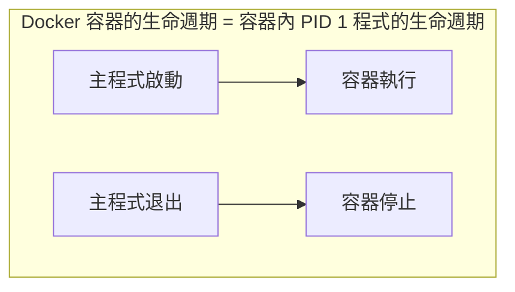

## 常駐執行

在生產環境中，我們通常需要容器持續執行，不受終端關閉的影響。本節將深入講解如何讓容器在後臺執行，以及理解容器生命週期的核心概念。

### 核心概念：前景 vs 後臺

當你在終端執行一個程式時，有兩種模式：

- **前景執行**：程式佔用當前終端，輸出直接顯示，關閉終端程式就停止
- **後臺執行**：程式在後臺執行，不佔用終端，終端關閉也不影響程式

Docker 容器預設是 **前景執行** 的。使用 `-d` (detach) 參數可以讓容器在後臺執行。

### 基本使用

#### 前景執行：預設

```bash
$ docker run ubuntu:24.04 /bin/sh -c "while true; do echo hello world; sleep 1; done"
hello world
hello world
hello world
hello world
```
容器會把輸出的結果 (STDOUT) 列印到宿主主機上面。此時：

- 終端被佔用，無法執行其他命令
- 按 `Ctrl+C` 會終止容器
- 關閉終端視窗，容器也會停止

#### 後臺執行：使用 -d 參數

```bash
$ docker run -d ubuntu:24.04 /bin/sh -c "while true; do echo hello world; sleep 1; done"
77b2dc01fe0f3f1265df143181e7b9af5e05279a884f4776ee75350ea9d8017a
```
使用 `-d` 參數後：

- 容器在後臺執行
- 回傳容器的完整 ID
- 終端立即釋放，可以繼續執行其他命令
- 輸出不會直接顯示（需要用 `docker logs` 查看）

### 深入理解：容器為什麼會「立即退出」？

> **這是初學者最常遇到的困惑。** 理解這個問題，你就理解了 Docker 的核心設計理念。

很多人嘗試這樣啟動容器：

```bash
$ docker run -d ubuntu:24.04
```
然後用 `docker ps` 查看，發現容器根本不在執行！這是為什麼？

#### 核心原理：容器的生命週期與主程式綁定


當你執行 `docker run -d ubuntu:24.04` 時：

1. 容器啟動
2. 沒有指定命令，預設執行 `/bin/bash`
3. 但沒有互動式終端機（沒有 `-it` 參數），bash 發現沒有輸入來源
4. bash 立即退出
5. 主程式退出，容器停止

**關鍵理解**：

- ❌ `-d` 參數 **不是** 讓容器「一直執行」
- ✅ `-d` 參數是讓容器「在後臺執行」，能執行多久取決於主程式

#### 常見的「立即退出」情境

| 情境 | 原因 | 解決方案 |
|------|------|---------|
| `docker run -d ubuntu` | 預設 bash 無輸入立即退出 | 指定長期執行的命令 |
| `docker run -d nginx` 後改了設定 | 設定錯誤導致 nginx 啟動失敗 | 查看 `docker logs` |
| 自訂映像檔容器啟動即退 | Dockerfile 的 CMD 執行完畢 | 確保 CMD 是前景程式 |

### 查看後臺容器

#### 查看執行中的容器

```bash
$ docker container ls
CONTAINER ID  IMAGE         COMMAND               CREATED        STATUS       PORTS NAMES
77b2dc01fe0f  ubuntu:24.04  /bin/sh -c 'while tr  2 minutes ago  Up 1 minute        agitated_wright
```

#### 查看容器輸出日誌

```bash
$ docker container logs 77b2dc01fe0f
hello world
hello world
hello world
...
```
**即時查看日誌**（類似 `tail -f`）：

```bash
$ docker container logs -f 77b2dc01fe0f
```

#### 查看已停止的容器

```bash
$ docker container ls -a
```
加上 `-a` 參數可以看到所有容器，包括已停止的。這對於除錯「容器啟動即退出」的問題非常有用。

### 最佳實踐

#### 1. 長期執行的服務使用 -d

```bash
## Web 伺服器

$ docker run -d -p 80:80 nginx:latest

## 資料庫

$ docker run -d -p 3306:3306 mysql:8.4

## 快取服務

$ docker run -d -p 6379:6379 redis:latest
```

> **版本說明**：範例使用常見的標籤如 `latest` 或穩定大版本號如 `mysql:8.4`。具體版本可根據需求調整，生產環境建議明確指定版本號（如 `mysql:8.4.4`）而非使用 `latest`。

#### 2. 除錯時先用前景模式

當容器啟動有問題時，**去掉 `-d` 參數** 可以直接看到輸出和錯誤：

```bash
## 有問題的容器，先前景執行看看發生了什麼

$ docker run myimage:v1.0.0
```

#### 3. 使用 --rm 自動清理

對於一次性任務，使用 `--rm` 參數讓容器退出後自動刪除：

```bash
$ docker run --rm ubuntu:24.04 echo "Hello, World!"
Hello, World!

## 容器執行完後自動刪除

...
```

#### 4. 配合日誌查看

```bash
## 後臺啟動

$ docker run -d --name myapp myimage:v1.0.0

## 查看最近 100 行日誌

$ docker logs --tail 100 myapp

## 即時跟踪日誌

$ docker logs -f myapp

## 查看帶時間戳記的日誌

$ docker logs -t myapp
```

### 常見問題排查

#### Q：容器啟動後立即退出

1. **查看退出狀態碼**：
   ```bash
   $ docker ps -a --filter "name=mycontainer"
   # 查看 STATUS 欄，如「Exited (1)」表示異常退出

   ```

2. **查看容器日誌**：
   ```bash
   $ docker logs mycontainer
   ```

3. **以互動模式除錯**：
   ```bash
   # /bin/sh 覆蓋映像檔原本的啟動命令，避免容器再次崩潰退出
   # 進入 shell 後可手動執行原啟動命令，定位具體報錯原因
   $ docker run -it myimage:v1.0.0 /bin/sh
   ```

#### Q：容器在後臺執行但無法存取服務

1. **檢查埠號映射**：
   ```bash
   $ docker port mycontainer
   ```

2. **檢查容器內服務狀態**：
   ```bash
   $ docker exec mycontainer ps aux
   ```

#### Q：如何讓已經在後臺執行的容器回到前景？

使用 `docker attach`：

```bash
$ docker attach mycontainer
```
> **注意**：`attach` 會連線到容器的主程式。如果主程式不是互動式的，你可能只能看到輸出。使用 `Ctrl+P` `Ctrl+Q` 可以安全退出而不停止容器。

### 延伸閱讀

- [進入容器](enter.md)：如何進入正在執行的容器執行命令
- [容器日誌](../appendix_practice/best_practices.md)：生產環境的日誌管理最佳實踐
- [HEALTHCHECK 健康檢查](../dockerfile/healthcheck.md)：自動檢測容器內服務是否正常
- [Docker Compose](../compose/README.md)：管理多個後臺容器的更好方式
