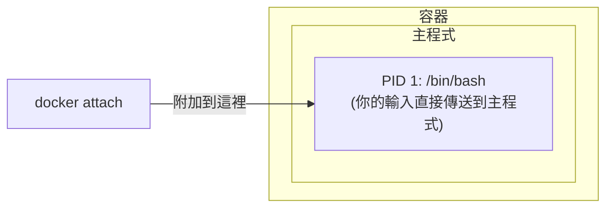
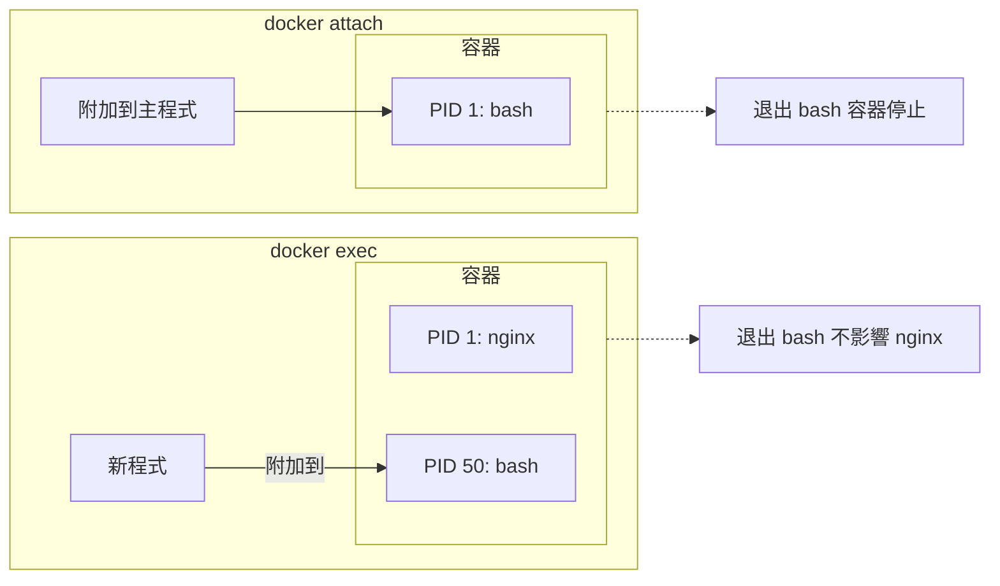

## 進入容器

### 為什麼需要進入容器

使用 `-d` 參數啟動容器後，容器在後臺執行。以下情境需要進入容器內部操作：

| 情境 | 範例 |
|------|------|
| **除錯問題** | 查看日誌、檢查設定、排查錯誤 |
| **臨時操作** | 執行資料庫遷移、清理快取 |
| **檢查狀態** | 查看程式、網路連線、檔案系統 |
| **開發測試** | 互動式測試命令、驗證環境 |

### 兩種進入方式

Docker 提供兩種進入容器的命令：

| 命令 | 推薦程度 | 特點 |
|------|---------|------|
| `docker exec` | ✅ **推薦** | 啟動新程式，退出不影響容器 |
| `docker attach` | ⚠️ 謹慎使用 | 附加到主程式，退出可能停止容器 |

---

### docker exec：推薦

#### docker exec 基本用法

```bash
## 進入容器並啟動互動式 shell

$ docker exec -it 容器名 /bin/bash

## 或使用 sh（適用於 Alpine 等精簡映像檔）

$ docker exec -it 容器名 /bin/sh
```

#### 參數說明

| 參數 | 作用 |
|------|------|
| `-i` | 保持標準輸入打開 (interactive)|
| `-t` | 分配虛擬終端機 (TTY)|
| `-it` | 兩者組合，獲得完整互動體驗 |
| `-u` | 指定使用者（如 `-u root`）|
| `-w` | 指定工作目錄 |
| `-e` | 設定環境變數 |

#### docker exec 範例

```bash
## 啟動一個後臺容器

$ docker run -dit --name myubuntu ubuntu
69d137adef7a...

## 進入容器（互動式 shell）

$ docker exec -it myubuntu bash
root@69d137adef7a:/# ls
bin  boot  dev  etc  home  lib  ...
root@69d137adef7a:/# exit

## 容器仍在執行！

$ docker ps
CONTAINER ID   IMAGE    STATUS         NAMES
69d137adef7a   ubuntu   Up 2 minutes   myubuntu
```

#### 執行單條命令

不進入互動模式，直接執行命令：

```bash
## 查看容器內程式

$ docker exec myubuntu ps aux

## 查看設定檔案

$ docker exec myubuntu cat /etc/nginx/nginx.conf

## 以 root 使用者執行

$ docker exec -u root myubuntu apt update
```

#### 只用 -i 不用 -t 的區別

```bash
## 只用 -i：可以執行命令，但沒有提示字元

$ docker exec -i myubuntu bash
ls           # 輸入命令
bin          # 輸出結果
boot
dev
...

## 用 -it：有完整的終端機體驗

$ docker exec -it myubuntu bash
root@69d137adef7a:/#    # 有提示字元
```
> 💡 通常使用 `-it` 組合。只有在腳本中需要透過管道傳入命令時才只用 `-i`。

---

### docker attach：謹慎使用

#### docker attach 基本用法

```bash
$ docker attach 容器名
```

#### 工作原理

`attach` 會附加到容器的 **主程式** (PID 1) 的標準輸入輸出：



#### docker attach 範例

```bash
## 啟動容器

$ docker run -dit --name myubuntu ubuntu
243c32535da7...

## 附加到容器

$ docker attach myubuntu
root@243c32535da7:/#
```

#### ⚠️ 重要警告

**從 attach 會話中輸入 `exit` 或按 `Ctrl+D` 會導致容器停止！**

```bash
$ docker attach myubuntu
root@243c32535da7:/# exit    # 這會停止容器！

$ docker ps
CONTAINER ID   IMAGE    STATUS                     NAMES
243c32535da7   ubuntu   Exited (0) 2 seconds ago   myubuntu
```
**原因**：attach 附加到主程式，退出主程式就等於退出容器。

#### 安全退出 attach

使用 `Ctrl+P` 然後 `Ctrl+Q` 可以從 attach 會話中 **分離**，而不停止容器：

```bash
$ docker attach myubuntu
root@243c32535da7:/#

## 按 Ctrl+P 然後 Ctrl+Q

read escape sequence

$ docker ps    # 容器仍在執行
CONTAINER ID   IMAGE    STATUS         NAMES
243c32535da7   ubuntu   Up 5 minutes   myubuntu
```
---

### exec vs attach 對比

| 特性 | docker exec | docker attach |
|------|-------------|---------------|
| **工作方式** | 在容器內啟動新程式 | 附加到主程式 |
| **退出影響** | 不影響容器 | 可能停止容器 |
| **多終端機** | 可以開多個 | 共享同一個會話 |
| **適用情境** | 除錯、臨時操作 | 查看主程式輸出 |
| **推薦程度** | ✅ 推薦 | ⚠️ 特殊情境使用 |


---

### 最佳實踐

#### 1. 首選 docker exec

```bash
## 進入容器除錯

$ docker exec -it myapp bash

## 查看日誌

$ docker exec myapp tail -f /var/log/app.log

## 執行資料庫遷移

$ docker exec myapp python manage.py migrate
```

#### 2. 生產環境避免進入容器

編者建議：生產環境應盡量避免進入容器直接操作，而是透過：

- 日誌系統查看日誌（如 `docker logs` 或集中式日誌）
- 監控系統查看狀態
- 重新部署而非手動修改

#### 3. 無 shell 映像檔的處理

某些精簡映像檔（如基於 `scratch` 或 `distroless`）沒有 shell：

```bash
## 這會失敗

$ docker exec -it myapp bash
OCI runtime exec failed: exec failed: unable to start container process: exec: "bash": executable file not found

## 解決方案：使用除錯容器（需要 Docker Desktop Pro/Team/Business 訂閱）

$ docker debug myapp
```
> **注意**：`docker debug` 是 Docker Desktop 4.33+ 提供的功能，需要 Pro、Team 或 Business 訂閱。它會附加一個包含常用除錯工具（vim、curl、htop 等）的工具箱到目標容器，即使目標映像檔基於 `scratch` 也能使用。
---

### 常見問題

#### Q：exec 進入後看不到其他終端機的操作

這是正常的。exec 啟動的是獨立程式，多個 exec 會話互不影響。

#### Q：容器沒有 bash

嘗試使用 sh：

```bash
$ docker exec -it myapp /bin/sh
```

#### Q：需要 root 權限

```bash
$ docker exec -u root -it myapp bash
```
---
