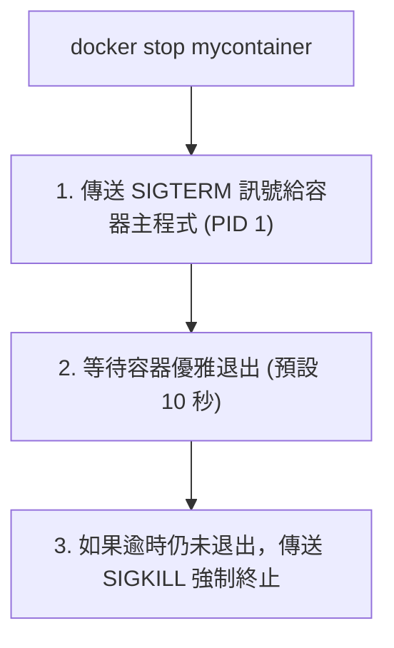
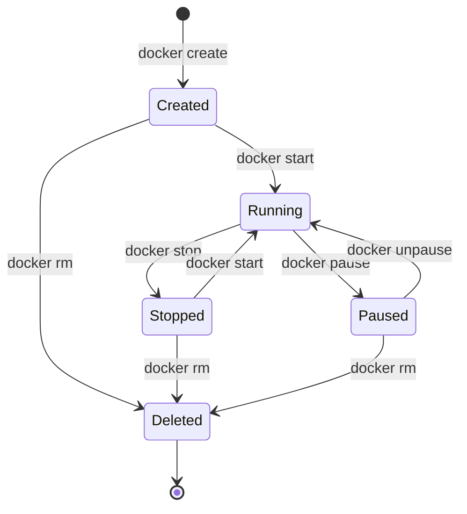

## 終止容器

本節將介紹如何終止一個執行中的容器，以及幾種不同的終止方式及其區別。

### 終止方式概述

終止容器有三種方式：

| 方式 | 命令 | 說明 |
|------|------|------|
| **優雅停止** | `docker stop` | 先發 SIGTERM，逾時後發 SIGKILL |
| **強制停止** | `docker kill` | 直接發 SIGKILL |
| **自動終止** | - | 容器主程式退出時自動停止 |

---

### docker stop：推薦

#### docker stop 基本用法

```bash
$ docker stop 容器名或ID
```

#### 工作原理



#### 自訂逾時時間

```bash
## 等待 30 秒後強制終止

$ docker stop -t 30 mycontainer

## 立即傳送 SIGKILL（相當於 docker kill）

$ docker stop -t 0 mycontainer
```

#### 停止多個容器

```bash
## 停止多個指定容器

$ docker stop container1 container2 container3

## 停止所有執行中的容器

$ docker stop $(docker ps -q)
```
---

### docker kill

#### 基本用法

```bash
$ docker kill 容器名或ID
```

#### 與 stop 的區別

| 命令 | 訊號 | 使用情境 |
|------|------|---------|
| `docker stop` | SIGTERM → SIGKILL | 正常停止，讓應用優雅退出 |
| `docker kill` | SIGKILL | 應用無回應，強制終止 |

#### 傳送自訂訊號

```bash
## 傳送 SIGHUP（讓程式重新載入設定）

$ docker kill -s HUP mycontainer

## 傳送 SIGTERM

$ docker kill -s TERM mycontainer
```
---

### 容器自動終止

容器的生命週期與主程式綁定。主程式退出時，容器自動停止：

```bash
## 主程式是互動式 bash

$ docker run -it ubuntu bash
root@abc123:/# exit    # 退出 bash → 容器停止

## 主程式執行完畢

$ docker run ubuntu echo "Hello"    # echo 執行完 → 容器停止
```
---

### 查看已停止的容器

```bash
$ docker ps -a
CONTAINER ID   IMAGE    COMMAND       STATUS                      NAMES
ba267838cc1b   ubuntu   "/bin/bash"   Exited (0) 2 minutes ago    myubuntu
c5d3a5e8f7b2   nginx    "nginx"       Up 5 minutes                mynginx
```
**STATUS 欄位說明**：

| 狀態 | 說明 |
|------|------|
| `Up X minutes` | 執行中 |
| `Exited (0)` | 正常退出（退出碼 0）|
| `Exited (1)` | 異常退出（非零退出碼）|
| `Exited (137)` | 被 SIGKILL 終止 (128 + 9)|
| `Exited (143)` | 被 SIGTERM 終止 (128 + 15)|

---

### 重新啟動容器

#### 啟動已停止的容器

```bash
$ docker start 容器名或ID

## 啟動並附加終端機

$ docker start -ai 容器名
```

#### 重啟執行中的容器

```bash
## 先停止再啟動

$ docker restart 容器名

## 自訂停止逾時

$ docker restart -t 30 容器名
```
---

### 生命週期狀態圖


---

### 批次操作

#### 停止所有容器

```bash
$ docker stop $(docker ps -q)
```

#### 刪除所有已停止的容器

```bash
$ docker container prune
```

#### 停止並刪除所有容器

```bash
$ docker stop $(docker ps -q) && docker container prune -f
```
---

### 常見問題

#### Q：容器停止很慢

原因：應用沒有正確處理 SIGTERM 訊號，需要等待逾時後強制終止。

解決方案：

1. 在應用中正確處理 SIGTERM
2. 使用 `docker stop -t 0` 立即終止
3. 檢查 Dockerfile 中的 `STOPSIGNAL` 設定

#### Q：如何讓容器優雅退出

確保容器主程式正確處理訊號：

```dockerfile
## Dockerfile 範例

FROM node:22-alpine
...

## 使用 exec 形式確保訊號能傳遞給 node 程式

CMD ["node", "server.js"]
```

> **版本說明**：範例使用 `node:22-alpine`，這是一個精簡的 Node.js 22 版本映像檔。可根據需求替換為其他版本（如 `node:24-alpine`、`node:latest`）。

#### Q：容器無法停止

```bash
## 強制終止

$ docker kill 容器名

## 如果仍無法停止，檢查系統資源

$ docker inspect 容器名
```
---
