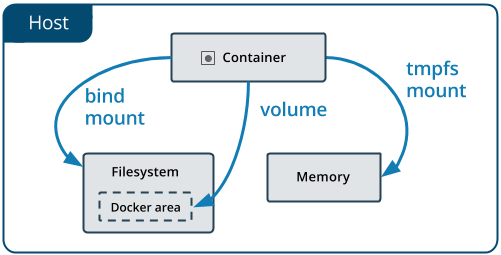

# Docker 資料管理

如圖所示，Docker 資料管理主要圍繞三類掛載方式展開。

  

Docker 資料掛載類型示意圖

這一章介紹如何在 Docker 內部以及容器之間管理資料，在容器中管理資料主要有以下幾種方式：

* [資料卷](volume.md)
* [掛載主機目錄](bind-mounts.md)
* [tmpfs 掛載](tmpfs.md)

## 本章小結

本章介紹了 Docker 的三種資料管理方式：資料卷 (Volume)、綁定掛載 (Bind Mount) 和 tmpfs 掛載。

| 方式 | 特點 | 適用場景 |
|------|------|---------|
| **資料卷 (Volume)** | Docker 管理，生命週期獨立於容器 | 資料庫、應用資料（推薦生產環境） |
| **綁定掛載 (Bind Mount)** | 掛載宿主機目錄，更靈活 | 開發環境、設定檔案、日誌 |
| **tmpfs 掛載** | 僅儲存在記憶體中，容器停止即消失 | 臨時敏感資料、高速快取 |

| 操作 | 命令 |
|------|------|
| 建立資料卷 | `docker volume create name` |
| 列出資料卷 | `docker volume ls` |
| 查看詳情 | `docker volume inspect name` |
| 刪除資料卷 | `docker volume rm name` |
| 清理未用 | `docker volume prune` |
| 掛載資料卷 | `-v name:/path` 或 `--mount source=name,target=/path` |

### 延伸閱讀

- [資料卷](volume.md)：Docker 管理的持久化儲存
- [綁定掛載](bind-mounts.md)：掛載宿主機目錄
- [tmpfs 掛載](tmpfs.md)：記憶體中的臨時儲存
- [Union 檔案系統](../underly/ufs.md)：Docker 儲存的底層原理
- [Compose 模板檔案](../compose/compose_file.md)：Compose 中的掛載設定

## 既有 philipz 內容補充

本章保留 philipz 特有的「資料卷容器」主題，見 [資料卷容器](container.md)。此主題上游已移除，僅在 philipz 版保留。
