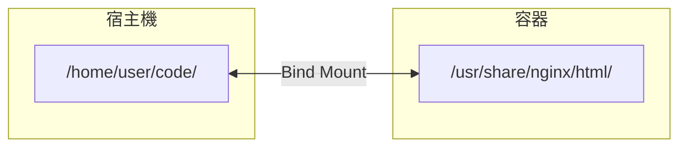

## 掛載主機目錄

### 什麼是綁定掛載

Bind Mount（綁定掛載）將 **Docker daemon 所在主機** 上的目錄或檔案直接掛載到容器中。容器可以讀寫這台主機上的檔案系統。


目錄結構（同一份檔案）：
```text
/home/user/code/ (或 /usr/share/nginx/html/)
├── index.html
├── style.css
└── app.js
```
---

### Bind Mount vs Volume

| 特性 | Bind Mount | Volume |
|------|------------|--------|
| **資料位置** | 宿主機任意路徑 | Docker 管理的目錄 |
| **路徑指定** | 必須是絕對路徑 | 卷名 |
| **可移植性** | 依賴宿主機路徑 | 更好（Docker 管理）|
| **效能** | 依賴宿主機檔案系統 | 最佳的儲存驅動 |
| **適用場景** | 開發環境、設定檔案 | 生產資料持久化 |
| **備份** | 直接存取檔案 | 需要透過 Docker |

#### 選擇建議

| 需求 | 推薦方案 |
|------|----------|
| 開發時同步程式碼 | Bind Mount |
| 持久化資料庫資料 | Volume |
| 共享設定檔案 | Bind Mount |
| 容器間共享資料 | Volume |
| 備份方便 | Bind Mount（直接存取）|
| 生產環境 | Volume |

---

### 基本語法

#### 使用 `--mount`：推薦

```bash
$ docker run -d \
    --mount type=bind,source=/宿主機路徑,target=/容器路徑 \
    nginx
```

#### 使用 `-v`：簡寫

```bash
$ docker run -d \
    -v /宿主機路徑:/容器路徑 \
    nginx
```

#### 兩種語法對比

| 特性 | --mount | -v |
|------|---------|-----|
| 語法 | 鍵值對，更清晰 | 冒號分隔，更簡潔 |
| 路徑不存在時 | 直接報錯 (Fail Fast) | 靜默自動建立 **目錄** |
| 推薦程度 | ✅ 推薦 | 常用 |

> **⚠️ 陷阱**：如果不小心掛載了一個不存在的主機路徑，使用 `-v` 會在 **daemon 主機** 上靜默建立一個空目錄。對於本地 Docker Desktop 使用者，這個主機通常就是本機；對於遠端 daemon，這個主機就是遠端機器。這也是 Docker 官方更推薦使用 `--mount` 的原因：它會直接報錯，避免因路徑拼寫錯誤而掛錯位置。

---

### 使用場景

#### 場景一：開發環境程式碼同步

```bash
## 將本地程式碼目錄掛載到容器

$ docker run -d \
    -p 8080:80 \
    --mount type=bind,source=$(pwd)/src,target=/usr/share/nginx/html \
    nginx

## 修改本地檔案，容器內立即生效（熱更新）

$ echo "Hello" > src/index.html

## 瀏覽器刷新即可看到變化

...
```

#### 場景二：設定檔案掛載

```bash
## 掛載自訂 nginx 設定

$ docker run -d \
    --mount type=bind,source=/path/to/nginx.conf,target=/etc/nginx/nginx.conf,readonly \
    nginx
```

#### 場景三：日誌收集

```bash
## 將容器日誌輸出到宿主機目錄

$ docker run -d \
    --mount type=bind,source=/var/log/myapp,target=/app/logs \
    myapp
```

#### 場景四：共享 SSH 金鑰

唯讀掛載可以防止容器修改主機金鑰，但不能防止容器讀取並外傳金鑰。只有在映像檔完全可信、金鑰作用域很窄且可隨時輪換時，才考慮這種做法。更穩妥的方式是使用 SSH agent socket 轉發、一次性 deploy key，或在 CI/建立場景中使用 BuildKit `--ssh`。

```bash
## 掛載 SSH 金鑰（唯讀）

$ docker run --rm -it \
    --mount type=bind,source=$HOME/.ssh,target=/root/.ssh,readonly \
    alpine ssh user@remote
```
---

### 唯讀掛載

防止容器修改宿主機檔案：

```bash
## --mount 語法

$ docker run -d \
    --mount type=bind,source=/config,target=/app/config,readonly \
    myapp

## -v 語法

$ docker run -d \
    -v /config:/app/config:ro \
    myapp
```
容器內嘗試寫入會報錯：

```bash
$ touch /app/config/new.txt
touch: /app/config/new.txt: Read-only file system
```
---

### 掛載單個檔案

```bash
## 掛載 bash 歷史記錄

$ docker run --rm -it \
    --mount type=bind,source=$HOME/.bash_history,target=/root/.bash_history \
    ubuntu bash

## 掛載自訂設定檔案

$ docker run -d \
    --mount type=bind,source=/path/to/my.cnf,target=/etc/mysql/my.cnf \
    mysql
```
> ⚠️ **注意**：掛載單個檔案時，如果宿主機上的檔案被編輯器替換（而非原地修改），容器內仍是舊檔案的 inode。建議重啟容器或掛載目錄。

---

### 查看掛載資訊

```bash
$ docker inspect mycontainer --format '{{json .Mounts}}' | jq
```
輸出：

```json
[
  {
    "Type": "bind",
    "Source": "/home/user/code",
    "Destination": "/app",
    "Mode": "",
    "RW": true,
    "Propagation": "rprivate"
  }
]
```
| 欄位 | 說明 |
|------|------|
| `Type` | 掛載類型 (bind)|
| `Source` | 宿主機路徑 |
| `Destination` | 容器內路徑 |
| `RW` | 是否可讀寫 |
| `Propagation` | 掛載傳播模式 |

---

### 常見問題

#### Q：路徑不存在報錯

```bash
$ docker run --mount type=bind,source=/not/exist,target=/app nginx
docker: Error response from daemon: invalid mount config for type "bind":
bind source path does not exist: /not/exist
```
**解決**：確保源路徑存在。若你確實需要自動建立目錄，可改用 `-v`，但要先確認建立位置就是你想要的主機路徑。

#### Q：權限問題

容器內使用者可能無權存取掛載的檔案：

```bash
## 方法1：確保宿主機檔案權限允許容器使用者存取

$ chmod -R 755 /path/to/data

## 方法2：以 root 執行容器

$ docker run -u root ...

## 方法3：使用相同的 UID

$ docker run -u $(id -u):$(id -g) ...
```

#### Q：macOS/Windows 效能問題

在 Docker Desktop 上，Bind Mount 效能通常不如 Volume，因為資料需要在宿主機檔案系統和 Linux VM 之間同步：

```bash
## 使用 :cached 或 :delegated 提高效能（macOS，僅 Docker Desktop 4.5 及更早版本）

$ docker run -v /host/path:/container/path:cached myapp
```
| 選項 | 說明 |
|------|------|
| `:cached` | 宿主機權威，容器讀取可能延遲 |
| `:delegated` | 容器權威，宿主機讀取可能延遲 |
| `:consistent` | 預設，完全一致（最慢）|

> **注意**：Docker Desktop 4.6+ 預設使用 VirtioFS 檔案共享引擎，上述 `:cached`/`:delegated` 選項已被靜默忽略。如需最佳化檔案同步效能，請參考 Docker Desktop 的 [Synchronized file shares](https://docs.docker.com/desktop/features/synchronized-file-sharing/) 功能。

---

### 最佳實踐

#### 1. 開發環境使用 Bind Mount

```bash
## 程式碼熱更新

$ docker run -v "$(pwd)":/app -w /app -p 3000:3000 node:22 npm run dev
```

#### 2. 生產環境使用 Volume

```bash
## 資料持久化

$ docker run -v mysql_data:/var/lib/mysql mysql
```

#### 3. 設定檔案使用唯讀掛載

```bash
$ docker run -v /config/nginx.conf:/etc/nginx/nginx.conf:ro nginx
```

#### 4. 注意路徑安全

```bash
## ❌ 危險：掛載根目錄或敏感目錄

$ docker run -v /:/host ...

## ✅ 只掛載必要的目錄

$ docker run -v /app/data:/data ...
```
---
