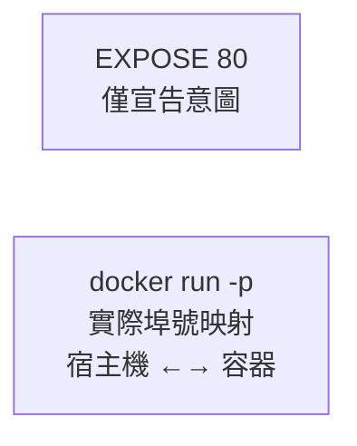

## EXPOSE 暴露埠號

### 基本語法

```docker
EXPOSE <埠號> [<埠號>/<協定>...]
```
`EXPOSE` 宣告容器執行期提供服務的埠號。這是一個 **文件性質的宣告**，告訴使用者容器會監聽哪些埠號。

---

### 基本用法

```docker
## 宣告單個埠號

EXPOSE 80

## 宣告多個埠號

EXPOSE 80 443

## 宣告 TCP 和 UDP 埠號

EXPOSE 80/tcp
EXPOSE 53/udp
```
---

### EXPOSE 的作用

#### 1. 文件說明

告訴映像檔使用者，容器將在哪些埠號提供服務：

```docker
## 使用者一看就知道這是 web 應用程式

EXPOSE 80 443
```
```bash
## 查看映像檔暴露的埠號

$ docker inspect nginx --format '{{.Config.ExposedPorts}}'
map[80/tcp:{}]
```

#### 2. 配合 -P 使用

使用 `docker run -P` 時，Docker 會自動映射 EXPOSE 的埠號到宿主機隨機埠號：

```docker
## Dockerfile

EXPOSE 80
```
```bash
$ docker run -P nginx
$ docker port $(docker ps -q)
80/tcp -> 0.0.0.0:32768
```
---

### EXPOSE vs -p

| 特性 | EXPOSE | -p |
|------|--------|-----|
| **位置** | Dockerfile | docker run 命令 |
| **作用** | 宣告/文件 | 實際埠號映射 |
| **是否必需** | 否 | 是（外部存取時）|
| **映射發生時** | 不發生 | 執行期發生 |



#### 沒有 EXPOSE 也能 -p

```docker
## 即使沒有 EXPOSE，也可以使用 -p

FROM nginx

## 沒有 EXPOSE

...
```
```bash
## 仍然可以映射埠號

$ docker run -p 8080:80 mynginx
```
---

### 常見誤解

#### 誤解：EXPOSE 會打開埠號

```docker
## ❌ 錯誤理解：這不會讓容器可從外部存取

EXPOSE 80
```
EXPOSE 不會：

- 自動進行埠號映射
- 讓服務可從外部存取
- 在容器啟動時開啟埠號監聽

EXPOSE 只是中繼資料宣告。容器是否實際監聽該埠號，取決於容器內的應用程式。

#### 正確理解

```docker
## Dockerfile

FROM nginx
EXPOSE 80    # 1. 宣告：這個容器會在 80 埠號提供服務
```
```bash
## 執行：需要 -p 才能從外部存取

$ docker run -p 8080:80 nginx    # 2. 映射：宿主機 8080 → 容器 80
```
---

### 最佳實踐

#### 1. 總是宣告應用程式使用的埠號

```docker
## Web 服務

FROM nginx
EXPOSE 80 443

## 資料庫

FROM postgres
EXPOSE 5432

## Redis

FROM redis
EXPOSE 6379
```

#### 2. 使用明確的協定

```docker
## 預設是 TCP

EXPOSE 80

## 明確指定 UDP

EXPOSE 53/udp

## 同時支援 TCP 和 UDP

EXPOSE 53/tcp 53/udp
```

#### 3. 與應用程式實際埠號保持一致

```docker
## ✅ 好：EXPOSE 與應用程式埠號一致

ENV PORT=3000
EXPOSE 3000
CMD ["node", "server.js"]

## ❌ 差：EXPOSE 與應用程式埠號不一致（誤導）

EXPOSE 80
CMD ["node", "server.js"]  # 實際監聽 3000
```
---

### 使用環境變數

```docker
ARG PORT=80
EXPOSE $PORT
```
---

### 在 Compose 中

在 Compose 中設定如下：

```yaml
services:
  web:
    build: .
    ports:
      - "8080:80"    # 映射埠號（類似 -p）
    expose:
      - "80"         # 僅宣告（類似 EXPOSE）
```
`expose` 在 Compose 中僅用於容器間通訊的文件說明，不進行埠號映射。

---
