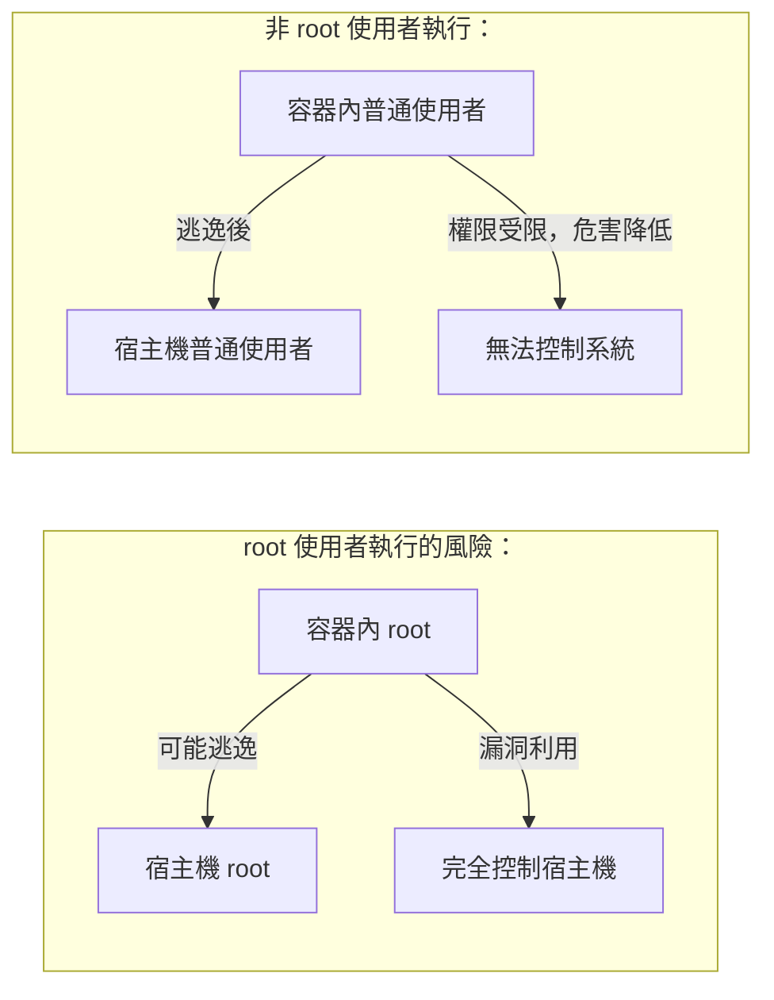

## USER 指定目前使用者

### 基本語法

```docker
USER <使用者名稱>[:<使用者群組>]
USER <UID>[:<GID>]
```
`USER` 指令切換後續指令 (RUN、CMD、ENTRYPOINT) 的執行使用者。

---

### 為什麼要使用 USER

> 筆者強調：以非 root 使用者執行容器是最重要的安全實踐之一。


---

### 基本用法

#### 建立並切換使用者

```docker
FROM node:22-alpine

## 1. 建立使用者和群組

RUN addgroup -g 1001 appgroup && \
    adduser -u 1001 -G appgroup -D appuser

## 2. 設定目錄權限

WORKDIR /app
COPY --chown=appuser:appgroup . .

## 3. 切換使用者

USER appuser

## 4. 後續命令以 appuser 身分執行

CMD ["node", "server.js"]
```

#### 使用 UID/GID

```docker
## 也可以使用數字

USER 1001:1001
```
---

### 使用者必須已存在

`USER` 指令只能切換到 **已存在** 的使用者：

```docker
## ❌ 錯誤：使用者不存在

USER nonexistent

## Error: unable to find user nonexistent

## ✅ 正確：先建立使用者

RUN useradd -r -s /bin/false appuser
USER appuser
```

#### 建立使用者的方式

**Debian/Ubuntu**：

```docker
RUN groupadd -r appgroup && \
    useradd -r -g appgroup appuser
```
**Alpine**：

```docker
RUN addgroup -g 1001 -S appgroup && \
    adduser -u 1001 -S -G appgroup appuser
```
| 選項 | 說明 |
|------|------|
| `-r` (useradd) / `-S` (adduser) | 建立系統使用者 |
| `-g` | 指定主群組 |
| `-G` | 指定附加群組 |
| `-u` | 指定 UID |
| `-s /bin/false` | 停用登入 shell |

---

### 執行時切換使用者

#### 使用 gosu：推薦

在 ENTRYPOINT 腳本中切換使用者時，不要使用 `su` 或 `sudo`，應使用 [gosu](https://github.com/tianon/gosu)：

```docker
FROM debian:bookworm

## 建立使用者

RUN groupadd -r redis && useradd -r -g redis redis

## 安裝 gosu

RUN apt-get update && apt-get install -y gosu && rm -rf /var/lib/apt/lists/*

COPY docker-entrypoint.sh /usr/local/bin/
ENTRYPOINT ["docker-entrypoint.sh"]
CMD ["redis-server"]
```
**docker-entrypoint.sh**：

```bash
#!/bin/bash
set -e

## 以 root 執行初始化

chown -R redis:redis /data

## 用 gosu 切換到 redis 使用者執行服務

exec gosu redis "$@"
```

#### 為什麼不用 su/sudo

| 問題 | su/sudo | gosu |
|------|---------|------|
| TTY 要求 | 需要 | 不需要 |
| 訊號傳遞 | 不正確 | 正確 |
| 子程式 | 是 | exec 替換 |
| 容器中使用 | ❌ | ✅ |

---

### 執行時覆蓋使用者

使用 `-u` 或 `--user` 參數：

```bash
## 以指定使用者執行

$ docker run -u 1001:1001 myimage

## 以 root 執行（偵錯時）

$ docker run -u root myimage
```
---

### 檔案權限處理

切換使用者後，確保應用有權存取檔案：

```docker
FROM node:22-alpine

## 建立使用者

RUN adduser -D -u 1001 appuser

WORKDIR /app

## 方式1：使用 --chown

COPY --chown=appuser:appuser . .

## 方式2：手動 chown（減少層數）

## COPY . .

## RUN chown -R appuser:appuser /app

USER appuser
CMD ["node", "server.js"]
```
---

### 最佳實踐

#### 1. 始終使用非 root 使用者

```docker
## ✅ 推薦

RUN adduser -D appuser
USER appuser
CMD ["myapp"]

## ❌ 避免

CMD ["myapp"]  # 以 root 執行
```

#### 2. 使用固定 UID/GID

便於在宿主機和容器間共用檔案：

```docker
## 使用常見的非 root UID

RUN addgroup -g 1000 -S appgroup && \
    adduser -u 1000 -S -G appgroup appuser
USER 1000:1000
```

#### 3. 多階段建立中的 USER

```docker
## 建立階段可以用 root

FROM node:22 AS builder
WORKDIR /app
COPY . .
RUN npm install && npm run build

## 生產階段用非 root

FROM node:22-alpine
RUN adduser -D appuser
WORKDIR /app
COPY --from=builder --chown=appuser:appuser /app/dist .
USER appuser
CMD ["node", "server.js"]
```
---

### 常見問題

#### Q：權限被拒絕

```bash
permission denied: '/app/data.log'
```
**解決**：確保目錄權限正確

```docker
RUN mkdir -p /app/data && chown appuser:appuser /app/data
```

#### Q：無法綁定低於 1024 的埠號

非 root 使用者無法綁定 80、443 等埠號。

**解決**：

1. 使用高埠號（如 8080）
2. 在執行時對應埠號：`docker run -p 80:8080`

---
