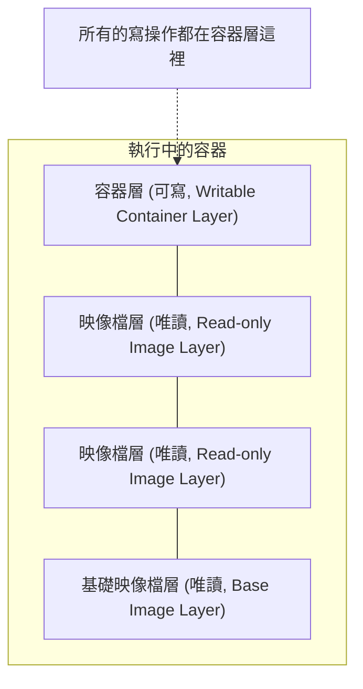

## 映像檔的實作原理

Docker 映像檔是怎麼實作增量的修改和維護的？為什麼容器啟動如此之快？這一切都歸功於 Docker 的映像檔分層儲存設計。

### 映像檔與分層儲存

在之前的章節中，我們一直強調映像檔包含作業系統完整的 `root` 檔案系統，其體積往往是龐大的。因此在 Docker 設計時，就充分利用 **Union FS** 的技術，將其設計為分層儲存的架構。

Docker 映像檔並不是一個單純的檔案，而是由一組檔案系統疊加構成的。

最底層的映像檔稱為 **基礎映像檔 (Base Image)**，通常是各種 Linux 發行版的 root 檔案系統，如 Ubuntu、Debian、CentOS 等。

當我們在基礎映像檔之上建立新的映像檔時（例如安裝了 Nginx），Docker 並不是複製一份基礎映像檔，而是在基礎映像檔之上，**新建一個層 (Layer)**，並在該層中僅記錄為了安裝 Nginx 而發生的檔案變更（添加、修改、刪除）。

這種分層儲存結構使得映像檔的複用、分發變得非常高效：

*   **複用**：如果多個映像檔都基於同一個基礎映像檔（例如都基於 `ubuntu:24.04`），那麼宿主主機只需要下載一份 `ubuntu:24.04`，所有映像檔都可以共享它。
*   **輕量分發**：映像檔可以複用已有層，只傳輸和儲存新增差異層；不過映像檔是否足夠小，仍然取決於基礎映像檔和新增內容本身。

### 容器層與讀寫

我們要理解的一個關鍵概念是：**映像檔的每一層都是唯讀的 (Read-only)**。

那麼，既然映像檔唯讀，容器為什麼能寫檔案呢？

當容器啟動時，Docker 會在映像檔的最上層，添加一個新的 **可寫層 (Writable Layer)**，通常被稱為 **容器層**。

*   **讀取檔案**：當容器需要讀取檔案時，Docker 會從最上層（容器層）開始向下層（映像檔層）尋找，直到找到該檔案為止。
*   **修改檔案**：當容器需要修改某個檔案時，Docker 會從下層映像檔中將該檔案複製到上層的容器層，然後對副本進行修改。這被稱為 **寫時複製 (Copy-on-Write，CoW)** 策略。
*   **刪除檔案**：當容器刪除某個檔案時，Docker 並不是真的去下層刪除它（因為下層是唯讀的），而是在容器層建立一個特殊的「白障 (Whiteout)」檔案，用來標記該檔案已被刪除，從而在容器視圖中隱藏它。

這就是為什麼：

1.  **容器刪除後資料會遺失**：因為所有的資料修改都儲存在最上層的容器層中，容器銷毀時，這個層也就隨之銷毀了。（除非使用了資料卷，詳見[資料管理](../data_management/README.md)）。
2.  **映像檔不可變**：無論我們在容器裡刪除了多少檔案，基礎映像檔的體積並不會減小，因為它們依然存在於底層的唯讀層中。

### 內容定址與映像檔 ID

Docker 映像檔的每一層都有一個唯一的 ID，這個 ID 是根據該層的內容計算出來的雜湊值 (SHA256)。這意味著：

*   **內容即 ID**：只要層的內容有一丁點變化，ID 就會變。
*   **安全性**：確保了映像檔內容的完整性，下載過程中如果資料損壞，ID 校驗就會失敗。
*   **去重**：如果兩個不同的映像檔（甚至是不同來源的映像檔）包含相同的層（ID 相同），Docker 引擎在本地端只會儲存一份，絕不重複下載。

### 聯合檔案系統

Docker 使用聯合檔案系統 (Union FS) 與寫時複製思路來實作這種分層掛載。傳統的實作方式常見於 `overlay2`、`aufs`、`btrfs`、`zfs` 等儲存驅動；而在 Docker Engine 29.0 及之後的全新安裝中，預設映像檔後端已經變為 containerd image store，它使用 snapshotter 來管理這些層。

> **版本背景**：Docker Engine 29.0.0 發佈於 2025 年 11 月 10 日，是一個重要版本分界點。Docker Engine 29.0 及之後的全新安裝預設使用 containerd image store；從更早版本升級的 daemon 會繼續使用 legacy graph driver，直到顯式啟用 containerd image store。Docker Desktop 4.34 及之後也預設啟用 containerd image store，實際環境仍應以當前設定為準。

雖然底層實作細節不同，但它們都遵循上述的 **分層 + CoW** 模型；因此，無論你看到的是 `overlay2` 還是 containerd snapshotter，理解映像檔層、容器層和寫時複製的方式都是一樣重要的。

> 想要深入了解 Overlay2 等檔案系統的具體實作原理，包括 WorkDir、UpperDir、LowerDir 等底層細節，請閱讀 **[底層實作](../underly/README.md)** 章節中的 **[Union 檔案系統](../underly/ufs.md)** 章節。
