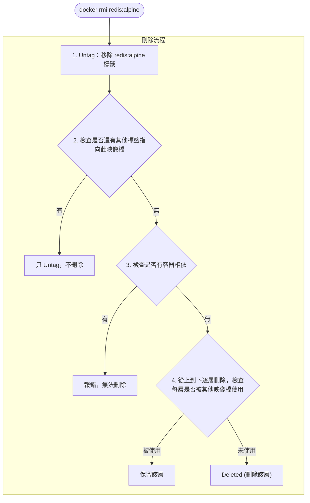

## 移除本機映像檔

當不再需要某個映像檔時，我們可以將其刪除以釋放儲存空間。本節介紹刪除映像檔的常用方法。

### 基本用法

使用 `docker image rm` 刪除本機映像檔：

```bash
$ docker image rm [選項] <映像檔1> [<映像檔2> ...]
```
> 💡 `docker rmi` 是 `docker image rm` 的簡寫，兩者等效。

---

### 映像檔標識方式

刪除映像檔時，可以使用多種方式指定映像檔：

| 方式 | 說明 | 範例 |
|------|------|------|
| **短 ID** | ID 的前幾位（通常 3-4 位）| `docker rmi 501` |
| **長 ID** | 完整的映像檔 ID | `docker rmi 501ad78535f0...` |
| **映像檔名:標籤** | 倉庫名和標籤 | `docker rmi redis:7.0` |
| **映像檔摘要** | 精確的內容摘要 | `docker rmi nginx@sha256:...` |

> **版本提示**：建議使用 **映像檔名:標籤** 的方式刪除，特別是當需要明確清理特定版本的映像檔時。例如 `docker rmi redis:7.0` 比 `docker rmi redis:latest` 更清晰且安全。

#### 使用短 ID 刪除

```bash
$ docker image ls
REPOSITORY   TAG     IMAGE ID       SIZE
redis        alpine  501ad78535f0   30MB
nginx        latest  e43d811ce2f4   142MB

## 只需輸入足夠區分的前幾位

$ docker rmi 501
Untagged: redis:alpine
Deleted: sha256:501ad78535f0...
```

#### 使用映像檔名刪除

```bash
$ docker rmi redis:alpine
Untagged: redis:alpine
Deleted: sha256:501ad78535f0...
```

#### 使用摘要刪除

摘要刪除最精確，適用於 CI/CD 場景：

```bash
## 查看映像檔摘要

$ docker images --digests
REPOSITORY   TAG    DIGEST                   IMAGE ID
nginx        latest sha256:b4f0e0bdeb5...    e43d811ce2f4

## 使用摘要刪除

$ docker rmi nginx@sha256:b4f0e0bdeb578043c1ea6862f0d40cc4afe32a4a582f3be235a3b164422be228
```
---

### 理解輸出資訊

執行刪除命令後，Docker 會輸出一系列的操作記錄，理解這些資訊有助於我們掌握映像檔刪除的機制。

刪除映像檔時會看到兩類資訊：**Untagged** 和 **Deleted**

```bash
$ docker rmi redis:alpine
Untagged: redis:alpine
Untagged: redis@sha256:f1ed3708f538b537eb9c2a7dd50dc90a706f7debd7e1196c9264edeea521a86d
Deleted: sha256:501ad78535f015d88872e13fa87a828425117e3d28075d0c117932b05bf189b7
Deleted: sha256:96167737e29ca8e9d74982ef2a0dda76ed7b430da55e321c071f0dbff8c2899b
Deleted: sha256:32770d1dcf835f192cafd6b9263b7b597a1778a403a109e2cc2ee866f74adf23
```

#### Untagged vs Deleted

| 操作 | 含義 |
|------|------|
| **Untagged** | 移除映像檔的標籤 |
| **Deleted** | 刪除映像檔的儲存層 |

#### 刪除流程

Docker 會檢測映像檔是否有容器相依或其他標籤指向，只有在確認為無用資源時才會真正刪除儲存層。


---

### 批次刪除

手動一個一個刪除映像檔非常繁瑣，Docker 提供了 `image prune` 命令和 shell 組合命令來實作批次清理。

#### 刪除所有虛懸映像檔

虛懸映像檔 (dangling)：沒有標籤的映像檔，通常是舊版本被新版本覆蓋後產生的

```bash
## 查看虛懸映像檔

$ docker images -f dangling=true

## 刪除虛懸映像檔

$ docker image prune

## 不提示確認

$ docker image prune -f
```

#### 刪除所有未使用的映像檔

```bash
## 刪除所有沒有被容器使用的映像檔

$ docker image prune -a

## 保留最近 24 小時的

$ docker image prune -a --filter "until=24h"
```

#### 按條件刪除

```bash
## 刪除所有 redis 映像檔

$ docker rmi $(docker images -q redis)

## 刪除 mongo:8.0 之前的所有映像檔

$ docker rmi $(docker images -q -f before=mongo:8.0)

## 刪除某個時間之前的映像檔

$ docker image prune -a --filter "until=168h"  # 7天前
```
---

### 刪除失敗的常見原因

在刪除映像檔時，Docker 可能會提示錯誤並拒絕執行。這通常是為了防止誤刪正在使用的資源。

#### 原因一：有容器相依

```bash
$ docker rmi nginx
Error: conflict: unable to remove repository reference "nginx"
(must force) - container abc123 is using its referenced image
```
**解決方案**：

```bash
## 方案1：先刪除相依的容器

$ docker rm abc123
$ docker rmi nginx

## 方案2：強制刪除映像檔（容器仍可執行，但無法再建立新容器）

$ docker rmi -f nginx
```

#### 原因二：多個標籤指向同一映像檔

```bash
$ docker images
REPOSITORY   TAG     IMAGE ID
ubuntu       24.04   ca2b0f26964c
ubuntu       latest  ca2b0f26964c   # 同一個映像檔

$ docker rmi ubuntu:24.04
Untagged: ubuntu:24.04

## 只是移除標籤，映像檔仍存在（因為還有 ubuntu:latest 指向它）
```
當同一個映像檔有多個標籤時，`docker rmi` 只是刪除指定的標籤，不會刪除映像檔本身。

#### 原因三：被其他映像檔相依：中間層

```bash
$ docker rmi some_base_image
Error: image has dependent child images
```
中間層映像檔被其他映像檔相依，無法刪除。需要先刪除相依它的映像檔。

---

### 常用過濾條件

| 過濾條件 | 說明 | 範例 |
|---------|------|------|
| `dangling=true` | 虛懸映像檔 | `-f dangling=true` |
| `before=映像檔` | 在某映像檔之前 | `-f before=mongo:3.2` |
| `since=映像檔` | 在某映像檔之後 | `-f since=mongo:3.2` |
| `label=key=value` | 按標籤過濾 | `-f label=version=1.0` |
| `reference=pattern` | 按名稱模式 | `-f reference='*:latest'` |

---

### 清理策略

針對不同的環境（開發環境 vs 生產環境），我們應該採用不同的映像檔清理策略。

#### 開發環境

```bash
## 定期清理虛懸映像檔

$ docker image prune -f

## 一鍵清理所有未使用資源

$ docker system prune -a
```

#### CI/CD 環境

```bash
## 只保留最近使用的映像檔

$ docker image prune -a --filter "until=72h" -f
```

#### 查看空間佔用

```bash
$ docker system df
TYPE            TOTAL   ACTIVE   SIZE      RECLAIMABLE
Images          15      3        2.5GB     1.8GB (72%)
Containers      5       2        100MB     80MB (80%)
Local Volumes   8       2        500MB     400MB (80%)
Build Cache     0       0        0B        0B
```
---
