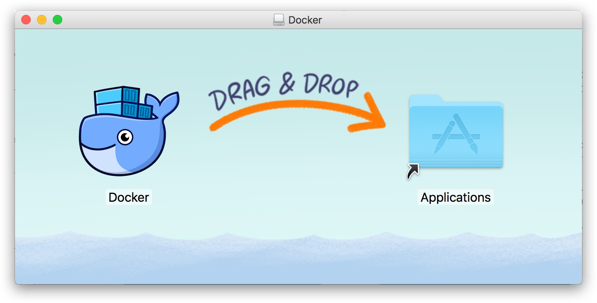
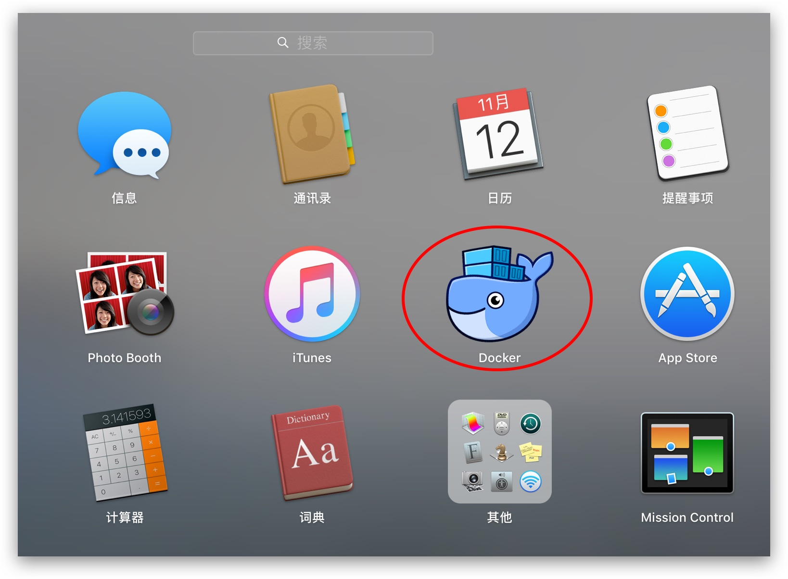
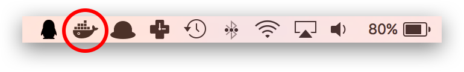
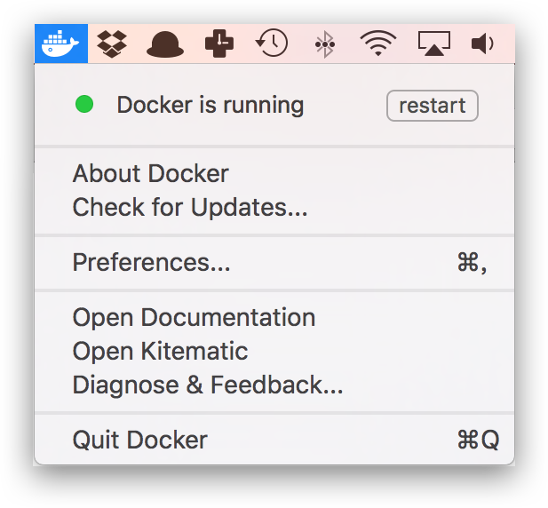
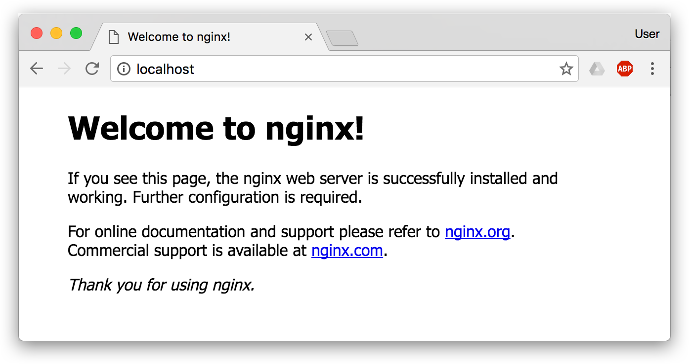

## macOS

### Mac 使用者的特殊考慮

macOS 上沒有原生 Linux 核心，Docker 需要執行在一個輕量級虛擬機中。Docker Desktop 完全封裝了這個複雜性，讓 Mac 使用者可以像 Linux 使用者一樣使用 Docker。但有幾點需要特別了解：

**效能特性**：

- Apple Silicon（M 系列晶片）比 Intel Mac 的效能更好，且擁有原生支援
- 檔案 I/O 效能：macOS 與容器之間的卷掛載效能不如 Linux（這是虛擬化的代價）
- 記憶體使用：Docker Desktop 本身會消耗一定記憶體用於虛擬機管理

**許可考慮**：

- 小型企業（少於 250 名員工且年收入低於 1000 萬美元）、個人使用、教育和非商業開源專案可免費使用
- 超出上述範圍的商業用途需要付費訂閱

### 系統要求

[Docker Desktop for Mac](https://docs.docker.com/desktop/setup/install/mac-install/) 支援目前版本及前兩個主要版本的 macOS（具體以官方 [安裝文件](https://docs.docker.com/desktop/setup/install/mac-install/) 為準），並且至少需要 4 GB 記憶體。對於 Apple Silicon 機型，若需要相容部分 Intel 命令列工具，官方建議安裝 Rosetta 2。

### 安裝

> [!WARNING]
> **商業許可限制**：Docker Desktop 對小型企業（少於 250 名員工且年收入低於 1000 萬美元）、個人使用、教育和非商業開源專案仍然免費。超出上述範圍的商業用途需要付費訂閱。企業使用者請注意合規風險。

Docker Desktop 為 Mac 使用者提供了標準的圖形化安裝體驗。官方目前主要提供 DMG 互動安裝和命令列/企業部署安裝；這裡先介紹最常見的 DMG 安裝方式。

#### 手動下載安裝

如果需要手動下載，可直接使用 [Docker Desktop for Mac Intel 版](https://desktop.docker.com/mac/main/amd64/Docker.dmg) 安裝套件。

> 如果你的電腦搭載的是 Apple Silicon 晶片（`arm64` 架構），請使用 [Docker Desktop for Mac Apple Silicon 版](https://desktop.docker.com/mac/main/arm64/Docker.dmg)。

如同 macOS 其他軟體一樣，安裝也非常簡單，雙擊下載的 `.dmg` 檔案，然後將那隻叫 [Moby](https://www.docker.com/blog/call-me-moby-dock/) 的鯨魚圖示拖曳到 `Application` 資料夾即可（其間需要輸入使用者密碼）。



### 執行

從應用中找到 Docker 圖示並點擊執行。



執行之後，會在右上角選單列看到多了一個鯨魚圖示，這個圖示表明了 Docker 的執行狀態。



每次點擊鯨魚圖示會彈出操作選單。



之後，你可以在終端機透過命令檢查安裝後的 Docker 版本。

```bash
$ docker version
$ docker info
```
如果 `docker version` 和 `docker info` 都能正常回傳資訊，就可以嘗試執行一個 [Nginx 伺服器](https://hub.docker.com/_/nginx/)：

```bash
$ docker run -d -p 80:80 --name webserver nginx
```
服務執行後，可以存取 [http://localhost](http://localhost)。如果看到了 `Welcome to nginx!`，就說明 Docker Desktop for Mac 安裝成功了。



要停止並刪除 Nginx 容器，執行下面的命令：

```bash
$ docker stop webserver
$ docker rm webserver
```

### 替代容器執行時期

Docker Desktop 並非 macOS 上執行容器的唯一選擇。以下兩個工具也廣泛使用，各有側重：

| 特性 | Docker Desktop | OrbStack | Colima |
|------|---------------|-----------|--------|
| 啟動速度 | 較慢（約 10–30 秒） | 極快（約 2 秒） | 中等（約 5–10 秒） |
| 閒置記憶體佔用 | 4–6 GB | 200–300 MB | 約 400 MB |
| 圖形介面 | 完整 GUI | 輕量 GUI | 僅命令列 |
| Apple Silicon | 支援 | 原生最佳化 | 支援 |
| 商業許可 | 大型企業需付費 | 個人免費，商業付費 | MIT 開源 |
| Kubernetes | 內建 | 內建 | 透過 k3s 支援 |

**[OrbStack](https://orbstack.dev/)**：以極低的資源佔用和接近原生的 I/O 效能著稱。對於 Apple Silicon 機型上需要頻繁建立映像檔的開發者，體驗提升尤為明顯。個人和教育用途免費。

**[Colima](https://github.com/abiosoft/colima)**：完全開源的命令列方案，底層基於 Lima 虛擬機。適合偏好終端機工作流、不需要 GUI 的開發者，或企業中希望避免商業許可限制的團隊。

> 上述三種工具均相容標準的 `docker` CLI 命令。從 Docker Desktop 切換到 OrbStack 或 Colima 時，已有的映像檔和容器設定通常可以平滑遷移。

### 映像檔加速

如果在使用過程中發現拉取 Docker 映像檔十分緩慢，可以設定 Docker [大陸映像檔加速](mirror.md)。
