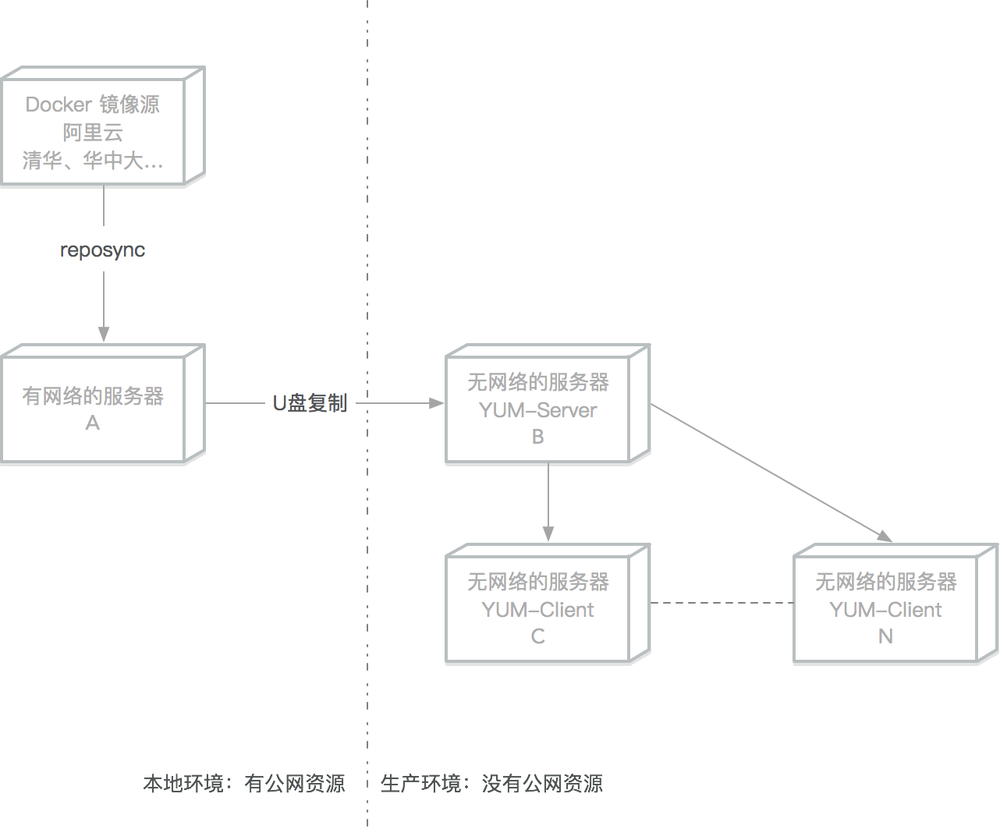

## Linux 離線安裝

生產環境中一般都是沒有公網資源的，本文介紹如何在生產伺服器上離線部署 `Docker`

括號內的字母表示該操作需要在哪些伺服器上執行



### CentOS/Rocky/AlmaLinux 離線安裝 Docker

在無法連接外網的安全環境中，離線安裝是唯一的選擇。本節介紹如何在 RHEL 系發行版中進行離線安裝。

> 注意：Docker 官方目前支援的 RHEL 相容平台基線已是 **CentOS Stream 9/10**（具體以官方 [安裝文件](https://docs.docker.com/engine/install/centos/) 為準）。下面的離線範例建議統一按 `el9` 軟體套件和 `dnf` 流程準備，Rocky Linux 9、AlmaLinux 9 也可先在測試環境按相同思路驗證。

### 本地 RPM 檔案安裝：推薦

推薦這種方式，是因為在生產環境中一般會選定某個指定的 Docker 軟體版本使用。

#### 查詢可用的軟體版本

```bash
$ sudo dnf -y install dnf-plugins-core
$ sudo dnf config-manager --add-repo https://download.docker.com/linux/rhel/docker-ce.repo
$ sudo dnf list docker-ce --showduplicates | sort -r
```
```bash
docker-ce.x86_64            3:29.4.0-1.el9                      docker-ce-stable
docker-ce.x86_64            3:29.3.1-1.el9                      docker-ce-stable
docker-ce.x86_64            3:29.3.0-1.el9                      docker-ce-stable
```

#### 下載到指定資料夾

```bash
sudo dnf install --downloadonly --downloaddir=/tmp/docker_offline_install/ \
  docker-ce-<VERSION_STRING> \
  docker-ce-cli-<VERSION_STRING> \
  containerd.io \
  docker-buildx-plugin \
  docker-compose-plugin
```

下載完成後，把 `/tmp/docker_offline_install/` 目錄中的全部 RPM 檔案複製到離線目標伺服器。

#### 在目標伺服器進入資料夾後安裝

* 離線安裝時，不要使用 `rpm --nodeps --force` 跳過相依檢查；應先把完整相依套件集複製到目標伺服器，再讓 `dnf` 從本地 RPM 安裝。

```bash
$ sudo dnf install ./*.rpm
```

#### 鎖定軟體版本（可選）

**下載鎖定版本軟體**

可參考下文的網路源搭建

```bash
$ sudo dnf install 'dnf-command(versionlock)'
```
**鎖定軟體版本**

```bash
$ sudo dnf versionlock add docker-ce docker-ce-cli containerd.io docker-buildx-plugin docker-compose-plugin
```
**查看鎖定列表**

```bash
$ sudo dnf versionlock list
```
**鎖定後無法再更新**

```bash
$ sudo dnf upgrade docker-ce
```
**解鎖指定軟體**

```bash
$ sudo dnf versionlock delete docker-ce docker-ce-cli containerd.io docker-buildx-plugin docker-compose-plugin
```
**解鎖所有軟體**

```bash
$ sudo dnf versionlock clear
```

#### 本地倉庫伺服器搭建安裝 Docker

##### 掛載 ISO 映像檔搭建本地 File 源

```bash
## 備份其他網路源

$ repo_backup="/etc/yum.repos.d/backup-$(date +%Y%m%d%H%M%S)"
$ sudo mkdir -p "$repo_backup"
$ sudo find /etc/yum.repos.d -maxdepth 1 -type f -name '*.repo' -exec mv {} "$repo_backup"/ \;

## 掛載光碟或者 iso 映像檔

$ sudo mount /dev/cdrom /mnt
```
```bash
## 新增本地源

$ sudo tee /etc/yum.repos.d/local-base.repo <<EOF
[local_base]
name=local_base
baseurl=file:///mnt
enabled=1
gpgcheck=1
EOF
```
```bash
## 測試剛才的本地源,安裝 createrepo 軟體

$ sudo dnf clean all
$ sudo dnf install -y createrepo_c httpd
```

##### 根據本地檔案搭建 BaseOS/AppStream 網路源

```bash
## 安裝 apache 伺服器

## 新建 centos 目錄

$ sudo mkdir -p /var/www/html/base

## 複製光碟內的檔案到剛才新建的目錄

$ sudo cp -R /mnt/* /var/www/html/base/
$ sudo createrepo_c /var/www/html/base/
$ sudo systemctl enable --now httpd
```

##### 下載 Docker CE 倉庫內容

在有網路的伺服器上同步 Docker CE RPM 套件：

```bash
$ sudo dnf -y install dnf-plugins-core
$ sudo dnf config-manager --add-repo https://download.docker.com/linux/rhel/docker-ce.repo
$ mkdir -p /tmp/docker-ce
$ sudo dnf reposync --repo=docker-ce-stable --download-path=/tmp/docker-ce
```

##### 建立倉庫索引

把下載的 docker-ce 資料夾複製到離線的伺服器

```bash
## 把 docker-ce 資料夾複製到 /var/www/html/docker-ce

$ sudo createrepo_c /var/www/html/docker-ce/
```

##### DNF 客戶端設定

```bash
$ repo_backup="/etc/yum.repos.d/backup-$(date +%Y%m%d%H%M%S)"
$ sudo mkdir -p "$repo_backup"
$ sudo find /etc/yum.repos.d -maxdepth 1 -type f -name '*.repo' -exec mv {} "$repo_backup"/ \;
$ sudo tee /etc/yum.repos.d/local-files.repo <<EOF
[local_base]
name=local_base

## 改成倉庫伺服器位址

baseurl=http://x.x.x.x/base
enabled=1
gpgcheck=1
proxy=_none_
[docker-ce-stable]
name=docker-ce-stable

## 改成倉庫伺服器位址

baseurl=http://x.x.x.x/docker-ce
enabled=1
gpgcheck=1
proxy=_none_
EOF

```

##### 安裝 Docker

```bash
$ sudo dnf makecache
$ sudo dnf install docker-ce docker-ce-cli containerd.io docker-buildx-plugin docker-compose-plugin
$ sudo systemctl enable --now docker
$ sudo docker run hello-world
```
