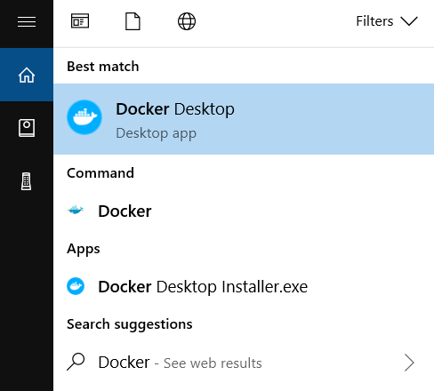

## Windows 10/11

在 Windows 平台上，Docker Desktop 提供了完整的 Docker 開發環境。本節介紹在 Windows 10/11 上的安裝和設定。

### Windows 上的 Docker：執行原理理解

與 macOS 類似，Windows 也沒有原生 Linux 容器支援。Docker Desktop for Windows 有兩種執行後端可選：

**WSL 2（Windows Subsystem for Linux 2）** - 推薦：

- 利用 Hyper-V 虛擬化執行真正的 Linux 核心
- 效能更好，檔案系統整合更深
- 現代 Windows 10/11 的標準選擇
- 支援在 Linux 和 Windows 之間的無縫檔案存取

**Hyper-V** - 傳統方案：

- 純虛擬化方式
- 效能略低於 WSL 2
- 在某些企業網路環境下仍被使用

**實踐建議**：WSL 2 和 Hyper-V 在功能上都能滿足 Docker Desktop 的日常開發需求，選擇哪種後端應以機器能力、企業策略和你的工作流為準；如果系統只滿足其中一種後端的前置條件，安裝器才會自動選擇可用的那一種。

### 系統要求

[Docker Desktop for Windows](https://docs.docker.com/desktop/setup/install/windows-install/) 支援 Docker 官方文件列出的受支援 Windows 10/11 64 位元版本（具體以官方 [安裝文件](https://docs.docker.com/desktop/setup/install/windows-install/) 為準）。若使用 WSL 2 後端，需要啟用 WSL 2，並滿足官方要求的 `WSL 2.1.5` 或更高版本；若使用 Hyper-V 後端，則需要啟用 Hyper-V 和 Containers 功能。Windows 10 64 位元支援 Enterprise、Pro 和 Education 22H2（build 19045），Windows 11 64 位元支援 Enterprise、Pro 和 Education 23H2（build 22631）或更高版本，且官方建議主機至少具備 8 GB 記憶體。

### 安裝

> [!WARNING]
> **商業許可限制**：Docker Desktop 對小型企業（少於 250 名員工且年收入少於 1000 萬美元）、個人使用、教育和非商業開源專案仍然免費。對於其他商業用途，以及政府機構使用，需要付費訂閱。企業使用者請注意合規風險。

**手動下載安裝**

官方目前提供三個主要入口：

- [Docker Desktop for Windows x86_64 安裝套件](https://desktop.docker.com/win/main/amd64/Docker%20Desktop%20Installer.exe)
- [Docker Desktop for Windows Microsoft Store 版本](https://apps.microsoft.com/detail/XP8CBJ40XLBWKX)
- [Docker Desktop for Windows Arm 早期存取版](https://desktop.docker.com/win/main/arm64/Docker%20Desktop%20Installer.exe)

下載好對應安裝套件後，雙擊 `Docker Desktop Installer.exe` 開始安裝。

**使用**[**winget**](https://learn.microsoft.com/windows/package-manager/winget/)**安裝**

```powershell
$ winget install Docker.DockerDesktop
```

### 在 WSL2 執行 Docker

若你的環境使用 WSL 2 後端，請先確認 `wsl --version` 滿足 Docker 官方的版本要求，並按 Docker Desktop 的 WSL 說明啟用對應功能。

### 執行

在 Windows 搜尋列輸入 **Docker** 點擊 **Docker Desktop** 開始執行。



Docker 啟動之後會在 Windows 工作列出現鯨魚圖示。


等待片刻，當鯨魚圖示靜止時，說明 Docker 啟動成功，之後你可以開啟 PowerShell 使用 Docker。

> 推薦使用 Windows Terminal 在終端機使用 Docker。

### 映像檔加速

如果在使用過程中發現拉取 Docker 映像檔十分緩慢，可以設定 Docker [大陸映像檔加速](mirror.md)。
