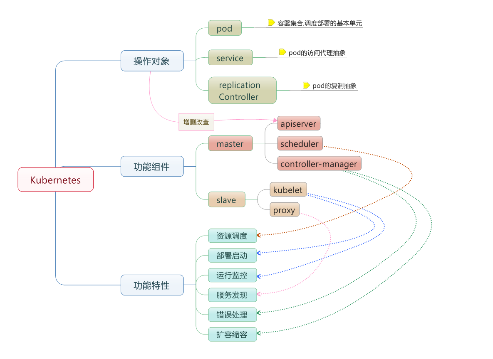

## 13.2 基本概念

如圖 13-2 所示，Kubernetes 由控制平面與工作節點構成。



圖 13-2：Kubernetes 基本概念示意圖

* 節點 (`Node`)：一個節點是一個執行 Kubernetes 中的主機。
* 容器組 (`Pod`)：Kubernetes 中最小的可部署和調度單元；一個 Pod 包含一個或多個緊密協作的容器，共享網路身份，並可共享一個或多個卷 (volume)。
* 容器組生命週期 (`pod-states`)：包含所有容器狀態集合，包括容器組狀態型別，容器組生命週期，事件，重啟策略。
* 服務 (`services`)：一個 Kubernetes 服務是容器組邏輯的高階抽象，同時也對外提供存取容器組的策略。
* 卷 (`volumes`)：一個卷就是一個目錄，容器對其有存取權限。
* 標籤 (`labels`)：標籤是用來連線一組物件的，比如容器組。標籤可以被用來組織和選擇子物件。
* 介面權限 (`accessing_the_api`)：埠號，IP 地址和代理的防火牆規則。
* web 介面 (`ux`)：使用者可以透過 Headlamp 等仍在維護的 web 介面觀察和操作 Kubernetes；歷史 Dashboard 已停止維護。
* 命令行操作 (`cli`)：`kubectl` 命令。

### 13.2.1 節點

在 `Kubernetes` 中，節點是實際工作的點，節點可以是虛擬機或者實體機器，依賴於一個集群環境。每個節點都有一些必要的元件以執行容器組，並且它們都可以透過控制平面來管理。必要元件包括 kubelet、容器執行時（如 containerd 或 CRI-O）和 kube-proxy；Docker 不再是 Kubernetes 節點的預設基線執行時。

#### 容器狀態

容器狀態用來描述節點的目前狀態。現在，其中包含三個資訊：

##### 主機 IP

主機 IP 需要雲平台來查詢，`Kubernetes` 把它作為狀態的一部分來儲存。如果 `Kubernetes` 沒有執行在雲平台上，節點 ID 就是必需的。IP 地址可以變化，並且可以包含多種型別的 IP 地址，如公共 IP，私有 IP，動態 IP，ipv6 等等。

##### 節點狀態

注：`Pending` / `Running` / `Succeeded` / `Failed` / `Unknown` 是 **Pod 的生命週期階段**（`pod.status.phase`），不是節點狀態。節點本身沒有 `Terminated` 狀態。

節點的狀態透過一組條件（Conditions）來描述。主要條件包括 `Ready`（kubelet 健康且可以接收 Pod）、`MemoryPressure`（記憶體不足）、`DiskPressure`（磁碟不足）和 `PIDPressure`（程式數過多）等。其中 `Ready` 條件最為關鍵：值為 `True` 表示節點健康可調度，`False` 表示節點異常，`Unknown` 表示節點控制器超過一定時間未收到心跳。被標記為 `Unknown` 較長時間的節點，其上的 Pod 會被驅逐並重新調度到其他節點。

#### 節點管理

節點並非 Kubernetes 建立，而是由雲平台建立，或者就是實體機器、虛擬機。在 Kubernetes 中，節點僅僅是一條記錄，節點建立之後，Kubernetes 會檢查其是否可用。可以透過 `kubectl` 查看節點資訊：

```bash
$ kubectl get nodes
NAME           STATUS   ROLES           AGE   VERSION
control-plane  Ready    control-plane   10d   v1.36.0
worker-1       Ready    <none>          10d   v1.36.0
worker-2       Ready    <none>          10d   v1.36.0
```
每個節點的詳細資訊以如下結構儲存：

```yaml
apiVersion: v1
kind: Node
metadata:
  name: worker-1
  labels:
    kubernetes.io/os: linux
status:
  capacity:
    cpu: "4"
    memory: 8Gi
  conditions:
    - type: Ready
      status: "True"
```

#### 節點控制器

在 Kubernetes 控制平面中，節點控制器 (Node Controller) 負責管理節點的生命週期，主要包含：

* 集群範圍內節點狀態同步
* 單節點生命週期管理

節點控制器會持續監控節點的健康狀態。當節點變為不可達時，控制器會等待一個超時期限，然後將該節點上的 Pod 標記為失敗，並觸發重新調度。可以使用 `kubectl` 來管理節點，例如標記節點為不可調度或排空節點上的工作負載：

```bash
## 標記節點為不可調度
$ kubectl cordon worker-1

## 排空節點上的 Pod
$ kubectl drain worker-1 --ignore-daemonsets
```

### 13.2.2 容器組

在 Kubernetes 中，使用的最小調度單位是容器組 (Pod)，它是建立、調度、管理的最小單位。一個 Pod 包含一個或多個緊密協作的容器，它們共享網路命名空間，並可共享一個或多個儲存卷。

Pod 通常不會被直接建立，而是透過 Deployment 等控制器來管理。當節點發生故障時，控制器會在其他可用節點上重新建立 Pod。

#### 容器組設計的初衷

容器組 (Pod) 的設計主要是為了解決應用間的緊密協作和資源共享問題。

#### 資源共享和通訊

容器組主要是為了資料共享和它們之間的通訊。

在一個容器組中，容器都使用相同的網路地址和埠號，可以透過本地網路來相互通訊。每個容器組都有獨立的 IP，可以透過網路來和其他實體主機或者容器通訊。

容器組可以掛載一組儲存卷（掛載點）。卷不只用於持久化，也可用於 `emptyDir` 臨時交換、ConfigMap/Secret 投射、日誌旁路收集等場景。真正需要跨 Pod 生命週期保留的資料，應使用 PersistentVolume / PersistentVolumeClaim 等持久化機制。

#### 容器組管理

容器組是一個應用管理和部署的高階抽象，同時也是一組容器的介面。容器組是部署、水平放縮的最小單位。

#### 容器組的使用

容器組可以透過組合來建立複雜的應用，典型的使用模式包含：

* 內容管理、檔案和資料載入以及本地快取管理等。
* 日誌和檢查點備份、壓縮、快照等。
* 監聽資料變化、跟蹤日誌、日誌和監控代理、訊息釋出等。
* 代理、網橋
* 控制器、管理、設定以及更新

#### 為什麼不在一個容器裡執行多個程式

1. **透明化**：為了使容器組中的容器保持一致的基礎設施和服務，比如程式管理和資源監控。
2. **解耦依賴**：每個容器都可能獨立地重新建立和釋出。
3. **方便使用**：使用者不必執行獨立的程式管理，也不用擔心每個應用程式的退出狀態。
4. **高效**：考慮到基礎設施有更多的職責，容器必須要輕量化。

#### 容器組的生命狀態

Pod phase 包括若干狀態值：`Pending`、`Running`、`Succeeded`、`Failed`、`Unknown`。

| 狀態 | 說明 |
|------|------|
| **Pending** | Pod 已被集群接受，但有一個或多個容器還沒有執行起來（可能在拉取映像檔）。|
| **Running** | Pod 已被調度到節點，並且所有容器都已啟動。至少有一個容器處於執行狀態。|
| **Succeeded** | Pod 中的所有容器都正常退出，且不會被重啟。|
| **Failed** | Pod 中的所有容器都已終止，且至少有一個容器以失敗狀態退出。|
| **Unknown** | 集群無法取得 Pod 狀態，常見原因是節點失聯。|

#### 容器組生命週期與重啟策略

Pod 的重啟策略 (`restartPolicy`) 決定了容器退出後的行為：

| 重啟策略 | 容器正常退出 | 容器異常退出 |
|---------|------------|------------|
| **Always**（預設）| 重啟容器 | 重啟容器 |
| **OnFailure** | 不重啟 | 重啟容器 |
| **Never** | 不重啟 | 不重啟 |

當節點故障或不可達時，Pod 可能先表現為 `Unknown`，之後根據控制器、驅逐策略和垃圾回收機制轉為 `Failed` 或被重新建立。如果這些 Pod 由 Deployment 等控制器管理，控制器會自動在其他節點上重新建立。

### 13.2.3 Deployment 與 ReplicaSet

Deployment 是管理無狀態應用的推薦方式，它透過 ReplicaSet 來確保指定數量的 Pod 副本始終在執行。

```yaml
apiVersion: apps/v1
kind: Deployment
metadata:
  name: nginx-deployment
spec:
  replicas: 3
  selector:
    matchLabels:
      app: nginx
  template:
    metadata:
      labels:
        app: nginx
    spec:
      containers:
        - name: nginx
          image: nginx:1.28
          ports:
            - containerPort: 80
```
Deployment 的核心能力包括：

* **副本管理**：確保始終有指定數量的 Pod 在執行
* **滾動更新**：逐步替換舊版本 Pod，實現零停機部署
* **回滾**：如果新版本出現問題，可以快速回滾到之前的版本

> 早期 Kubernetes 使用 Replication Controller (RC) 來管理副本，現已被 ReplicaSet/Deployment 取代。

### 13.2.4 StatefulSet

Deployment 適合無狀態應用，而 **StatefulSet** 用於管理有狀態應用（如資料庫、訊息佇列）。與 Deployment 不同，StatefulSet 為每個 Pod 提供穩定的網路標識和持久化儲存。

```yaml
apiVersion: apps/v1
kind: StatefulSet
metadata:
  name: mysql
spec:
  serviceName: mysql
  replicas: 3
  selector:
    matchLabels:
      app: mysql
  template:
    metadata:
      labels:
        app: mysql
    spec:
      containers:
        - name: mysql
          image: mysql:8.4
          volumeMounts:
            - name: data
              mountPath: /var/lib/mysql
  volumeClaimTemplates:
    - metadata:
        name: data
      spec:
        accessModes: ["ReadWriteOnce"]
        resources:
          requests:
            storage: 10Gi
```

StatefulSet 的核心特性：

* **穩定的網路標識**：Pod 名稱按順序編號（mysql-0, mysql-1, mysql-2），配合 Headless Service 提供可預測的 DNS 名稱
* **有序部署與刪除**：Pod 按序號順序建立，逆序刪除
* **持久化儲存**：透過 `volumeClaimTemplates` 為每個 Pod 自動建立獨立的 PVC

### 13.2.5 DaemonSet

**DaemonSet** 確保在集群的每個節點（或指定節點）上執行一個 Pod 副本。典型用途包括日誌收集、監控代理和網路外掛。

```yaml
apiVersion: apps/v1
kind: DaemonSet
metadata:
  name: fluentd
spec:
  selector:
    matchLabels:
      app: fluentd
  template:
    metadata:
      labels:
        app: fluentd
    spec:
      containers:
        - name: fluentd
          image: fluent/fluentd:v1.17
          volumeMounts:
            - name: varlog
              mountPath: /var/log
      volumes:
        - name: varlog
          hostPath:
            path: /var/log
```

當新節點加入集群時，DaemonSet 會自動在該節點上建立 Pod；當節點被移除時，對應的 Pod 也會被回收。

### 13.2.6 Job 與 CronJob

**Job** 用於執行一次性任務，確保指定數量的 Pod 成功完成後自動退出。**CronJob** 則按照 cron 表示式週期性地建立 Job。

```yaml
apiVersion: batch/v1
kind: Job
metadata:
  name: data-migration
spec:
  completions: 1
  template:
    spec:
      containers:
        - name: migrate
          image: myapp/migrate:latest
          command: ["python", "migrate.py"]
      restartPolicy: Never
  backoffLimit: 3
```

```yaml
apiVersion: batch/v1
kind: CronJob
metadata:
  name: daily-backup
spec:
  schedule: "0 2 * * *"
  jobTemplate:
    spec:
      template:
        spec:
          containers:
            - name: backup
              image: myapp/backup:latest
          restartPolicy: OnFailure
```

Job 的 `backoffLimit` 控制失敗重試次數，`completions` 指定需要成功完成的 Pod 數量。CronJob 適用於定時備份、報表生成等場景。

### 13.2.7 服務

服務 (Service) 定義了一組 Pod 的邏輯集合和存取策略。由於 Pod 的 IP 地址是動態分配的，Service 提供了一個穩定的存取入口。

```yaml
apiVersion: v1
kind: Service
metadata:
  name: nginx-service
spec:
  selector:
    app: nginx
  ports:
    - port: 80
      targetPort: 80
  type: ClusterIP
```
常見的 Service 型別：

| 型別 | 說明 |
|------|------|
| **ClusterIP** | 預設型別，僅集群內部可存取 |
| **NodePort** | 在每個節點上開放固定埠號，集群外部可透過 `節點IP:埠號` 存取 |
| **LoadBalancer** | 透過雲平台的負載均衡器暴露服務 |

### 13.2.8 卷

卷 (Volume) 為 Pod 中的容器提供持久化儲存。Kubernetes 支援多種卷型別：

| 卷型別 | 說明 |
|-------|------|
| **emptyDir** | 臨時儲存，Pod 刪除後資料丟失 |
| **hostPath** | 掛載節點上的檔案或目錄 |
| **PersistentVolumeClaim** | 使用持久卷宣告，與底層儲存解耦 |
| **configMap / secret** | 將設定或敏感資料掛載為檔案 |

生產環境中，推薦使用 PersistentVolume (PV) 和 PersistentVolumeClaim (PVC) 來管理儲存，實現儲存資源與使用者的解耦。

### 13.2.9 標籤

標籤 (Label) 是附加到 Kubernetes 物件上的鍵值對，用於組織和選擇物件子集。標籤是 Kubernetes 中實現鬆耦合的關鍵機制。

```bash
## 為 Pod 加入標籤
$ kubectl label pod my-pod env=production

## 透過標籤選擇器查詢
$ kubectl get pods -l env=production
```
Service、Deployment 等資源都透過標籤選擇器 (`selector`) 來關聯目標 Pod。

### 13.2.10 API 存取控制

Kubernetes API 的存取透過三個階段進行控制：

1. **認證 (Authentication)**：驗證請求者的身份（如憑證、Token、OIDC）
2. **授權 (Authorization)**：判斷請求者是否有權限執行操作（通常使用 RBAC）
3. **准入控制 (Admission Control)**：在請求被持久化之前對其進行校驗或修改

### 13.2.11 Dashboard

Kubernetes Dashboard 是一個基於 Web 的使用者介面，用於部署容器化應用、監控集群資源和排查問題。Dashboard 的部署方法詳見[部署 Dashboard](../kubernetes_setup/dashboard.md) 章節。

### 13.2.12 命令行工具 kubectl

`kubectl` 是 Kubernetes 的命令行工具，用於與集群進行互動。常用命令如下：

```bash
## 查看集群中的資源
$ kubectl get pods,deployments,services,nodes

## 建立資源
$ kubectl apply -f deployment.yaml

## 查看 Pod 日誌
$ kubectl logs my-pod

## 進入 Pod 執行命令
$ kubectl exec -it my-pod -- /bin/sh

## 查看資源詳情
$ kubectl describe pod my-pod
```
更多 kubectl 操作詳見[kubectl 命令行](../kubernetes_setup/kubectl.md)章節。
