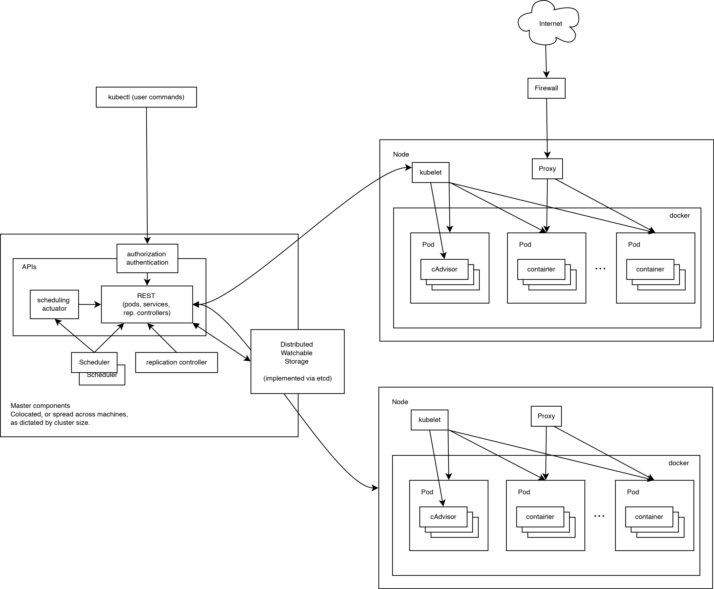
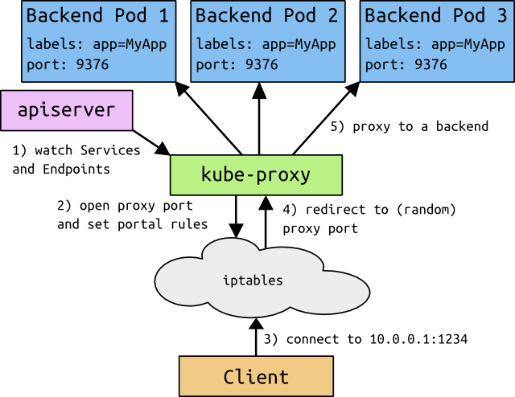

## 13.3 架構設計

任何優秀的專案都離不開優秀的架構設計。本小節將介紹 Kubernetes 在架構方面的設計考慮。

### 13.3.1 基本考慮

如果讓我們自己從頭設計一套容器管理平台，有如下幾個方面是很容易想到的：

* 分散式架構，保證擴充性；
* 邏輯集中式的控制平面 + 實體分散式的執行平面；
* 一套資源調度系統，管理哪個容器該分配到哪個節點上；
* 一套對容器內服務進行抽象和 HA 的系統。

### 13.3.2 執行原理

如圖 13-3 所示，該圖完整展示了 Kubernetes 的執行原理。

圖 13-3：Kubernetes 執行原理圖

可見，Kubernetes 首先是一套分散式系統，由多個節點組成，節點分為兩類：一類是屬於管理平面的主節點/控制節點 (Master Node)；一類是屬於執行平面的工作節點 (Worker Node)。

顯然，複雜的工作肯定都交給控制節點去做了，工作節點負責提供穩定的操作介面和能力抽象即可。

從這張圖上，我們沒有能發現 Kubernetes 中對於控制平面的分散式實現，但是由於資料後端自身就是一套分散式的資料庫 Etcd，因此可以很容易擴充到分散式實現。

### 13.3.3 控制平面

控制平面 (Control Plane) 是 Kubernetes 集群的大腦，負責做出全域決策（如調度）以及檢測和響應集群事件。

#### 主節點服務

主節點上需要提供如下的管理服務：

* `apiserver` 是整個系統的對外介面，提供一套 RESTful 的 [Kubernetes API](https://kubernetes.io/zh-cn/docs/concepts/overview/kubernetes-api/)，供客戶端和其他元件呼叫；
* `scheduler` 負責對資源進行調度，分配某個 pod 到某個節點上。是 pluggable 的，意味著很容易選擇其他實現方式；
* `controller-manager` 負責管理控制器，包括 endpoint-controller（重新整理服務和 pod 的關聯資訊）和 replication-controller（維護某個 pod 的複製為設定的數值）。

#### Etcd

這裡 Etcd 既作為資料後端，又作為訊息中介軟體。

透過 Etcd 來儲存所有的主節點上的狀態資訊，很容易實現主節點的分散式擴充。

元件可以自動的去偵測 Etcd 中的數值變化來獲得通知，並且獲得更新後的資料來執行相應的操作。

### 13.3.4 工作節點

* kubelet 是工作節點執行操作的 agent，負責具體的容器生命週期管理，根據從資料庫中取得的資訊來管理容器，並上報 pod 執行狀態等；
* kube-proxy 是一個簡單的網路存取代理，同時也是一個 Load Balancer。它負責將存取到某個服務的請求具體分配給工作節點上的 Pod（同一類標籤）。

圖 13-4：kube-proxy 請求轉發示意圖
