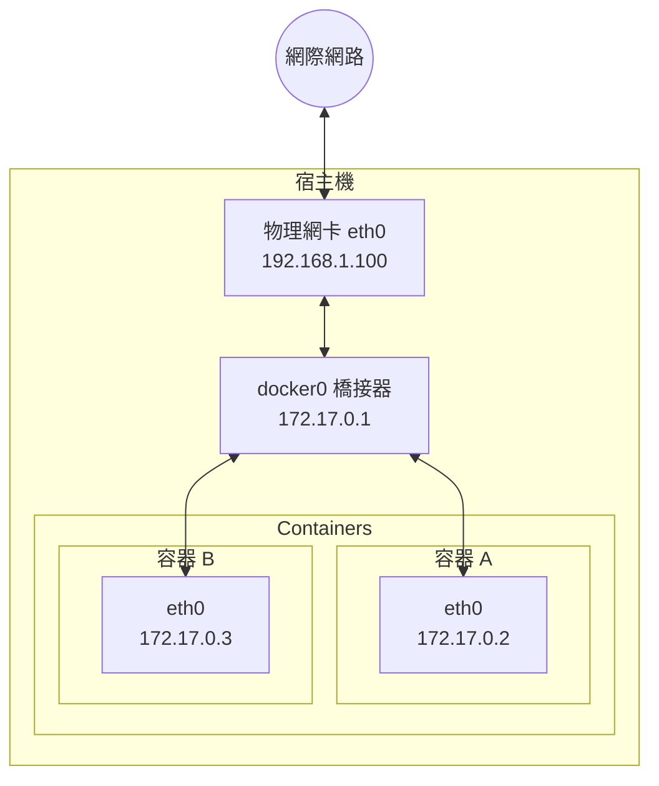

# Docker 中的網路設定

Docker 容器需要網路來與外部世界通訊、容器之間相互通訊以及與宿主機通訊。Docker 在安裝時會自動設定網路基礎設施，大多數情況下開箱即用。

## 概述

Docker 啟動時自動建立以下網路元件：

本章將詳細介紹 Docker 網路設定的各個方面。

## 本章內容

* [設定 DNS](dns.md)
* [網路類型](network_types.md)
* [自訂網路](custom_network.md)
* [容器互連](linking.md)
* [外部存取容器](port_mapping.md)
* [網路隔離](network_isolation.md)
* [進階網路設定](advanced_networking.md)

## 本章小結

本章介紹了 Docker 網路設定的各個方面：

| 概念 | 要點 |
|------|------|
| **DNS 設定** | 自訂網路支援嵌入式 DNS，可透過容器名解析 |
| **網路類型** | bridge（預設）、host、none、overlay、macvlan |
| **自訂網路** | 推薦使用，支援容器名 DNS 解析和更好的隔離 |
| **容器互連** | 同一自訂網路內容器可直接透過容器名通訊 |
| **埠號映射** | `-p 宿主機埠號:容器埠號` 暴露服務到外部 |
| **網路隔離** | 不同網路預設隔離，增強安全性 |
| **--link** | 已廢棄，使用自訂網路替代 |

### 延伸閱讀

- [設定 DNS](dns.md)：自訂 DNS 設定
- [網路類型](network_types.md)：Bridge、Host、None 等網路模式
- [自訂網路](custom_network.md)：建立和管理自訂網路
- [容器互連](linking.md)：容器間通訊方式
- [埠號映射](port_mapping.md)：進階埠號設定
- [網路隔離](network_isolation.md)：網路安全與隔離策略
- [EXPOSE 指令](../dockerfile/expose.md)：在 Dockerfile 中聲明埠號
- [Compose 模板檔案](../compose/compose_file.md)：Compose 中的網路設定
