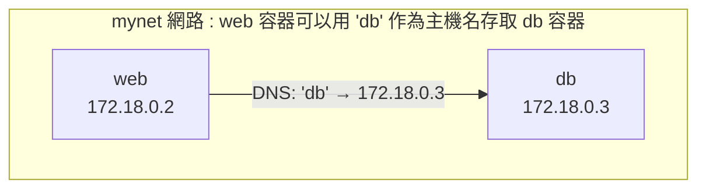

## 自訂網路

在生產環境中，推薦使用使用者自訂網路代替預設的 bridge 網路。自訂網路提供了更好的隔離性和服務發現能力。

### 為什麼要用自訂網路

預設 bridge 網路存在以下局限，而自訂網路可以很好地解決這些問題：

| 問題 | 自訂網路的優勢 |
|------|-----------------|
| 只能用 IP 通訊 | 支援容器名 DNS 解析 |
| 所有容器在同一網路 | 更好的隔離性 |
| 需要 --link（已廢棄）| 原生支援服務發現 |

### 建立自訂網路

使用 `docker network create` 命令可以建立自訂網路：

```bash
## 建立網路

$ docker network create mynet

## 查看網路詳情

$ docker network inspect mynet
```

### 使用自訂網路

啟動容器時透過 `--network` 參數指定連接的網路：

```bash
## 啟動容器並連接到自訂網路

$ docker run -d --name web --network mynet nginx
$ docker run -d --name db --network mynet postgres

## 在 web 容器中可以直接用容器名存取 db

$ docker exec web ping db
PING db (172.18.0.3): 56 data bytes
64 bytes from 172.18.0.3: seq=0 ttl=64 time=0.083 ms
```

### 容器名 DNS 解析

自訂網路自動提供 DNS 服務。Docker 守護程式在 `127.0.0.11` 執行了一個嵌入式 DNS 伺服器，容器內的 DNS 請求會被轉發到這裡：

- 如果是容器名，解析為容器 IP
- 如果是外部網域名稱（如 google.com），轉發給上游 DNS



### 常用網路命令

以下是 Docker 網路管理中常用的命令：

```bash
## 列出網路

$ docker network ls

## 建立網路

$ docker network create mynet

## 查看網路詳情

$ docker network inspect mynet

## 連接容器到網路

$ docker network connect mynet mycontainer

## 斷開網路連接

$ docker network disconnect mynet mycontainer

## 刪除網路

$ docker network rm mynet

## 清理未使用的網路

$ docker network prune
```
---

> **🔥 踩坑實錄**
>
> 一個新手開發者透過 `docker compose` 部署了兩個容器化服務：服務 A 和服務 B。他在服務 A 的程式碼中嘗試用 `localhost:3000` 存取服務 B，結果始終連接超時。這個錯誤非常隱蔽——在本地單機開發時看不出問題，因為他可能在同一個程式中測試。排查時他錯誤地認為是防火牆或網路設定問題。實際原因是：每個容器都有獨立的網路命名空間，`localhost` 在容器內部只指向容器自己，不是宿主機也不是其他容器。正確的做法是使用 Compose 自動建立的服務名作為主機名：`http://service-b:3000`。Compose 會自動在網路中註冊服務名的 DNS，這樣容器間通訊才能正確解析。改動僅需一行程式碼，問題隨之消失。
