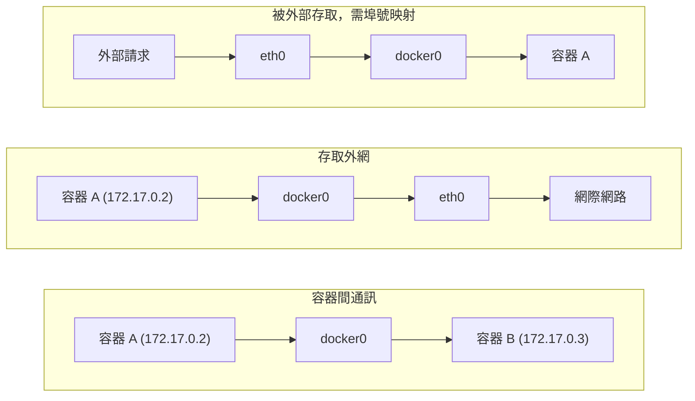

## 網路類型

Docker 提供了多種網路驅動來滿足不同的使用場景。安裝 Docker 後，系統會自動建立三個預設網路：

```bash
$ docker network ls
NETWORK ID     NAME      DRIVER    SCOPE
abc123...      bridge    bridge    local
def456...      host      host      local
ghi789...      none      null      local
```

### 網路類型對比

各網路類型的特點和適用場景如下：

| 網路類型 | 說明 | 適用場景 |
|---------|------|---------|
| **bridge** | 預設類型，容器連接到虛擬橋接器 | 大多數單機場景 |
| **host** | 容器直接使用宿主機網路棧 | 需要最高網路效能時 |
| **none** | 禁用網路 | 完全隔離的容器 |
| **overlay** | 跨主機網路 | Docker Swarm 集群 |
| **macvlan** | 容器擁有獨立 MAC 位址 | Linux 主機上需要直接接入物理網路 |
| **ipvlan** | 容器共享父介面 MAC，獨享 IP | 同網段大量容器、對 MAC 數量受限的網路 |

### Bridge 網路：預設

Bridge 是 Docker 預設使用的網路模式。在原生 Linux Docker Engine 上，Docker 啟動時通常會建立 `docker0` 虛擬橋接器，未指定網路的容器會連接到這個橋接器上。Docker Desktop 執行在虛擬機內，宿主機上不會直接看到 `docker0`，也不能假設宿主機可直接存取每個容器 IP。

核心元件如下：

| 元件 | 說明 |
|------|------|
| **docker0** | 虛擬橋接器，充當交換機角色 |
| **veth pair** | 虛擬網卡對，一端在容器內，一端連接橋接器 |
| **容器 eth0** | 容器內的網卡 |
| **IP 位址** | 自動從 172.17.0.0/16 網段分配 |

### Host 網路

使用 `--network host` 參數啟動的容器會直接使用宿主機的網路棧，不再擁有獨立的網路命名空間。容器內的埠號就是宿主機的埠號，無需埠號映射。

```bash
$ docker run -d --network host nginx
```
這種模式下網路效能最高，但容器之間和宿主機之間沒有網路隔離。

> 注意：host 網路優先用於明確需要高效能或大量埠號的 Linux 主機場景。Docker Desktop 僅在較新版本中支援，且需要在設定中啟用；使用 host 網路時 `-p` / `--publish` 埠號映射不會生效。普通 Web 服務預設仍建議使用 bridge 網路並顯式發布埠號。

### None 網路

使用 `--network none` 參數啟動的容器只有 `lo` 回環網卡，完全沒有外部網路連接。適用於只需要執行計算任務、不需要網路的容器。

```bash
$ docker run -it --network none alpine ip addr
1: lo: <LOOPBACK,UP,LOWER_UP> ...
    inet 127.0.0.1/8 scope host lo
```

### Macvlan 與平台限制

Macvlan 適合少數需要讓容器像物理主機一樣直接出現在二層網路中的場景。它只支援 Linux 主機，不支援 Docker Desktop for Mac / Windows，也不支援 rootless 模式；多數雲廠商網路會阻斷或限制 macvlan。預設情況下，macvlan 容器與宿主機直接通訊也需要額外路由或介面設定。

### 資料流向

容器網路中的資料流向可以分為以下幾種情況：


