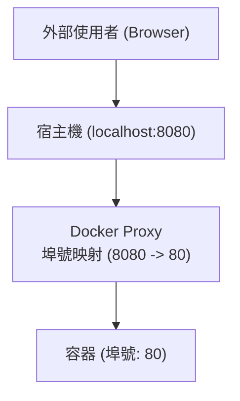

## 外部存取容器

容器執行在自己的隔離網路環境中（通常是 Bridge 模式）。為了讓外部網路存取容器內的服務，我們需要將容器的埠號映射到宿主機的埠號。

### 為什麼要映射埠號

容器的網路存取規則如下：

- **容器之間**：可以透過 IP 或容器名（自訂網路）互通。
- **宿主機存取容器**：原生 Linux 環境下可按網路設定存取容器 IP；Docker Desktop 上不能依賴容器 IP，應透過埠號映射、容器名（容器間）或 `host.docker.internal` 等機制存取。
- **外部網路存取容器**：❌ 預設無法直接存取。

為了讓外部（如你的瀏覽器、其他區域網路機器）存取容器內的服務，我們需要將容器的埠號 **映射** 到宿主機的埠號。


---

### 埠號映射方式

Docker 提供了多種方式來指定埠號映射。

#### 1. 指定映射

使用 `-p <宿主機埠號>:<容器埠號>` 格式：

```bash
## 將宿主機的 8080 埠號映射到容器的 80 埠號

$ docker run -d -p 8080:80 nginx
```
此時存取 `http://localhost:8080` 即可看到 Nginx 頁面。

**多種格式**：

| 格式 | 含義 | 範例 |
|------|------|------|
| `ip:hostPort:containerPort` | 綁定指定 IP 的特定埠號 | `-p 127.0.0.1:8080:80`（僅 IPv4 本機存取）|
| `ip::containerPort` | 綁定指定 IP 的隨機埠號 | `-p 127.0.0.1::80` |
| `hostPort:containerPort` | 綁定所有位址（通常包括 `0.0.0.0` 和 `[::]`）的特定埠號 | `-p 8080:80`（預設）|
| `containerPort` | 綁定所有位址的隨機埠號 | `-p 80` |

#### 2. 隨機映射

如果不關心宿主機使用哪個埠號，可以使用隨機映射。使用 `-P`（大寫）參數，Docker 會把 Dockerfile 中 `EXPOSE` 指令暴露的所有埠號發布到宿主機的隨機高位埠號。具體落在哪個埠號，取決於宿主機目前可用的臨時埠號範圍。

```bash
$ docker run -d -P nginx
```
查看映射結果：

```bash
$ docker ps
CONTAINER ID   PORTS
abc123456      0.0.0.0:49153->80/tcp
```
此時 Nginx 被映射到了宿主機的一個隨機高位埠號，例如 `49153`。

---

### 查看埠號映射

可以使用以下命令查看容器的埠號映射：

#### docker port

執行 `docker port` 可以查看到指定容器的埠號映射情況：

```bash
$ docker port mycontainer
80/tcp -> 0.0.0.0:8080
80/tcp -> [::]:8080
```

#### docker ps

執行 `docker ps` 可以查看到所有容器的埠號映射列表：

```bash
$ docker ps
CONTAINER ID   IMAGE     PORTS                  NAMES
abc123456      nginx     0.0.0.0:8080->80/tcp   web
```
---

### 最佳實踐與安全

在設定埠號映射時，需要注意以下安全事項：

#### 1. 限制監聽 IP

預設情況下，`-p 8080:80` 會監聽所有可用位址，常見輸出包括 `0.0.0.0:8080` 和 `[::]:8080`。這意味著任何人只要能連接你的宿主機 IP，就能存取該服務。

如果不希望對外暴露（例如資料庫服務），應綁定到回環位址。IPv4 使用 `127.0.0.1`，IPv6 使用 `[::1]`：

```bash
## 僅允許本機存取

$ docker run -d -p 127.0.0.1:3306:3306 mysql
$ docker run -d -p '[::1]:3306:3306' mysql
```

#### 2. 避免埠號衝突

如果宿主機 8080 已經被佔用了，容器將無法啟動。

**解決**：

- 更換宿主機埠號：`-p 8081:80`
- 讓 Docker 自動分配：`-p 80`

#### 3. UDP 映射

預設是 TCP 協定。如果要映射 UDP 服務（如 DNS，Syslog）：

```bash
$ docker run -d -p 53:53/udp dns-server
```
---

### 實作原理

Docker 使用 `docker-proxy` 程式（使用者態）或 `iptables` DNAT 規則（核心態）來實作埠號轉發。

當流量到達宿主機埠號時，iptables 規則將其目標位址修改為容器 IP 並轉發：

```bash
## 簡化的 iptables 邏輯

iptables -t nat -A DOCKER -p tcp --dport 8080 -j DNAT --to-destination 172.17.0.2:80
```
這也是為什麼你在容器內部看到的存取來源 IP 通常是閘道 IP（如 172.17.0.1），而不是真實的外部 Client IP（除非使用 host 網路模式）。

---
