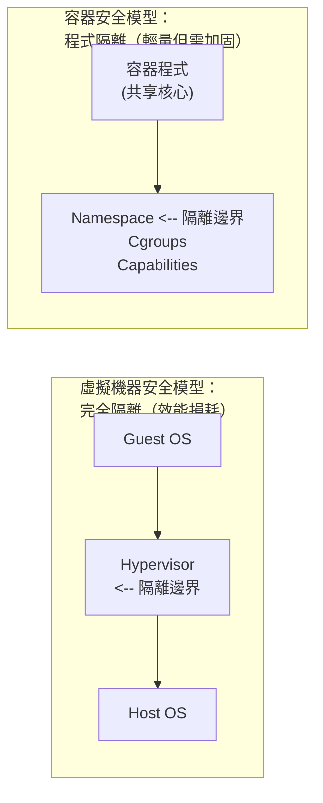

# 安全

容器安全是生產環境部署的核心考量。本章介紹 Docker 的安全機制和最佳實務。

## 容器安全的本質

> **核心問題**：容器共享宿主機核心，隔離性弱於虛擬機器。如何在便利性和安全性之間取得平衡？

## 本章內容

本章涵蓋 Docker 安全的多個層面，從核心隔離機制到執行期防護和供應鏈安全。

* [核心命名空間](kernel_ns.md)
  * 命名空間的安全意義、User Namespace 與提權防護。

* [控制組](control_group.md)
  * 透過 Cgroups 限制容器資源使用，防止資源耗盡攻擊。

* [伺服端防護](daemon_sec.md)
  * Docker 守護程式的安全設定與網路存取控制。

* [核心能力機制](kernel_capability.md)
  * Linux Capabilities 的細緻權限控制。

* [其他安全特性](other_feature.md)
  * 映像檔安全（漏洞掃描、簽名驗證）、執行期安全（非 root 執行、唯讀檔案系統、Seccomp、AppArmor）、Dockerfile 安全實務、軟體供應鏈安全（SBOM、SLSA）。

* [映像檔安全掃描與供應鏈安全](image_security.md)
  * 容器映像檔的安全掃描、漏洞檢測與簽名驗證。

## 安全掃描清單

部署前檢查：

| 檢查項 | 命令/方法 |
|--------|----------|
| 漏洞掃描 | `docker scout cves` 或 `trivy` |
| 非 root 執行 | 檢查 Dockerfile 中的 `USER` |
| 資源限制 | 檢查 `-m`, `--cpus` 參數 |
| 唯讀檔案系統 | 檢查 `--read-only` |
| 無特權模式 | 確認沒有 `--privileged` |
| 最小能力 | 檢查 `--cap-drop=all` |
| 網路隔離 | 檢查網路設定 |
| 敏感資訊 | 確認無硬編碼密碼 |

## 本章小結

Docker 的安全性依賴多層隔離機制的協同工作，同時需要使用者遵循最佳實務。本章涵蓋的核心安全維度包括：

| 維度 | 關鍵措施 |
|------|---------|
| **核心隔離** | Namespace 隔離程式/網路/檔案系統，Cgroups 限制資源使用 |
| **權限控制** | 非 root 執行、`--cap-drop ALL` 最小能力集、`--read-only` 唯讀根檔案系統 |
| **映像檔安全** | 使用可信基礎映像檔、定期掃描漏洞（Trivy / Snyk）、啟用 Sigstore / Notation / Registry 原生簽名驗證；DCT 僅作為遺留遷移對象 |
| **執行期防護** | Seccomp 系統呼叫過濾、AppArmor / SELinux 強制存取控制 |
| **網路隔離** | 自訂 bridge 網路隔離容器通訊、限制容器對宿主機網路的存取 |

總體來看，Docker 容器還是十分安全的，特別是在容器內不使用 root 權限來執行程式的話。

另外，使用者可以使用現有工具，比如 [AppArmor](https://docs.docker.com/engine/security/apparmor/)，[Seccomp](https://docs.docker.com/engine/security/seccomp/)，SELinux，GRSEC 來增強安全性；甚至自己在核心中實作更複雜的安全機制。
