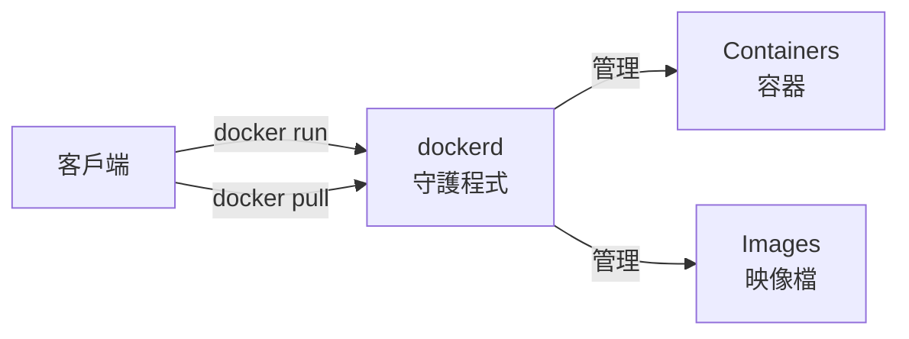
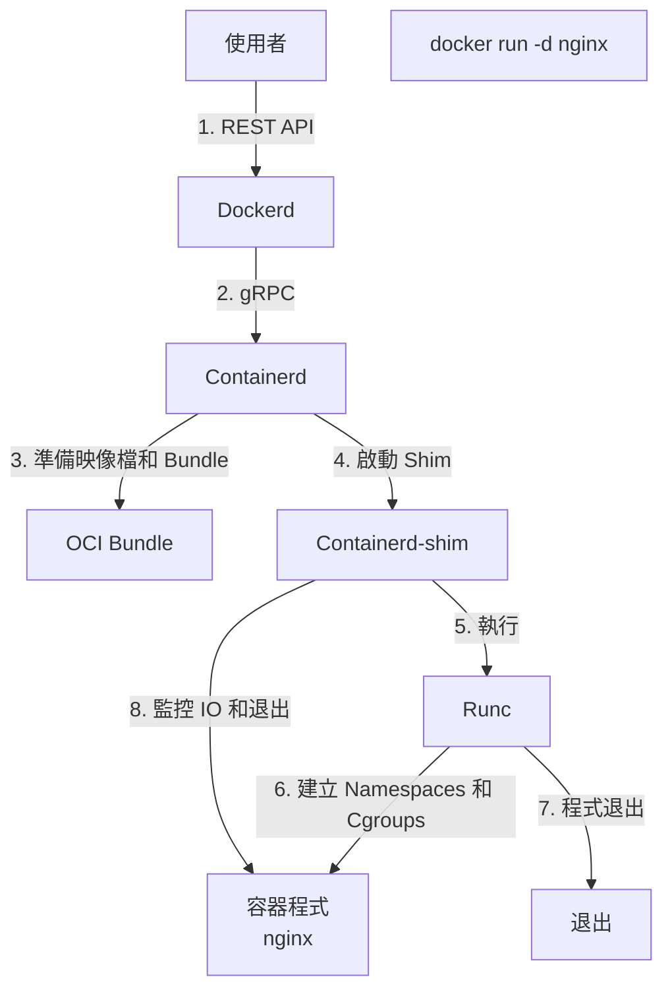
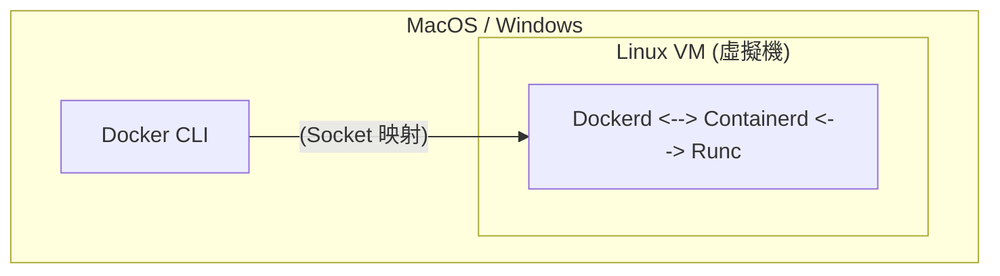

## 基本架構

Docker 的架構設計簡潔而高效，主要由客戶端和服務端兩部分組成。

### 核心架構圖

Docker 採用了 **C/S（客戶端/服務端）** 架構。Client 向 Daemon 發送請求，Daemon 負責建立、執行和分發容器。

---

### 元件詳解

Docker 的內部架構如同洋蔥一樣分層，每一層專注解決特定問題：

#### 1. Docker CLI：客戶端

使用者與 Docker 互動的主要方式。它將使用者命令（如 `docker run`）轉換為 API 請求發送給 dockerd。

#### 2. Dockerd：守護程式

Docker 的大腦。

- 監聽 API 請求
- 管理 Docker 物件（映像檔、容器、網路、卷）
- 編排下層元件完成工作

#### 3. Containerd：進階執行時期

業界標準的容器執行時期（CNCF 畢業專案）。

- 管理容器的完整生命週期（啟動、停止）
- 映像檔拉取與儲存
- **不包含** 複雜的與容器無關的功能（如建立、API）
- Kubernetes 也可以直接使用 containerd（跳過 Docker）

#### 4. Runc：低階執行時期

用於建立和執行容器的 CLI 工具。

- 直接與核心互動 (Namespaces，Cgroups)
- 遵循 OCI (Open Container Initiative) 規範
- **主要職責**：根據設定啟動一個容器，然後退出（將控制權交給容器程式）

#### 5. Shim

每個容器都有一個 shim 程式。

- **解耦**：允許 dockerd 重新啟動而不影響容器執行
- **保持 IO**：維持容器的標準輸入輸出
- **狀態回報**：向 containerd 回報容器退出狀態

---

### 容器啟動流程

當執行 `docker run -d nginx` 時，內部發生了什麼？

1. **CLI** 發送請求給 **Dockerd**
2. **Dockerd** 解析請求，呼叫 **Containerd**
3. **Containerd** 準備映像檔，轉換為 OCI Bundle
4. **Containerd** 建立 **Shim** 程式
5. **Shim** 呼叫 **Runc**
6. **Runc** 與系統核心互動，建立 Namespaces 和 Cgroups
7. **Runc** 啟動 nginx 程式後退出
8. **Shim** 接管容器 IO 和生命週期監控

---

### Docker Engine v29.x 變化

從 Docker Engine v29.x 開始，架構進一步簡化和標準化：

- **Containerd 映像檔儲存 (Image Store)**：在 v29.x 的新安裝場景中預設啟用。Docker 直接使用 Containerd 的映像檔管理能力，不再維護自己的一套 graphdriver。
  - **優勢**：多平台映像檔支援更好，可保存 SBOM/Provenance 等 attestations，並可使用 containerd snapshotters 的 lazy pulling 等能力。
- **實驗性 nftables 支援**：隨著主流 Linux 發行版逐步棄用 iptables，Docker v29.x 引入了實驗性 nftables 後端。啟用方式為 `dockerd --firewall-backend=nftables`，可直接建立 nftables 規則而無需依賴 iptables-nft 轉換層。生產環境請謹慎使用。

---

### Docker Desktop 架構

在 macOS 和 Windows 上，因為核心差異，架構稍微複雜：

- 使用輕量級虛擬機 (Apple Virtualization / WSL 2) 執行 Linux 核心
- 檔案掛載 (Bind Mount) 需要跨越 VM 邊界（這也是檔案 I/O 慢的原因）
- 網路埠號需要從宿主機轉發到 VM

---

### 總結

| 元件 | 角色 | 關鍵職責 |
|------|------|----------|
| **CLI** | 指揮官 | 發送指令，展示結果 |
| **Dockerd** | 大管家 | API 介面，整體調度 |
| **Containerd** | 經理 | 容器生命週期，映像檔管理 |
| **Shim** | 監工 | 保持 IO，允許無守護程式重新啟動 |
| **Runc** | 工人 | 真正幹活（建立容器），幹完就走 |

### 延伸閱讀

- [命名空間](namespace.md)：Runc 如何隔離容器
- [控制組](cgroups.md)：Runc 如何限制資源
- [Union 檔案系統](ufs.md)：映像檔如何儲存
