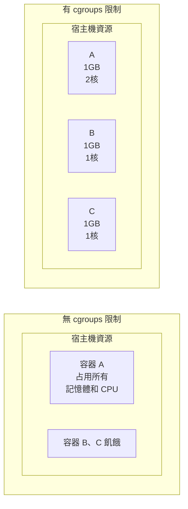

## 控制組

控制組 (Cgroups) 是 Linux 核心提供的另一種關鍵機制，主要用於資源的限制和審計。

### 什麼是控制組

控制組（Control Groups，簡稱 cgroups）是 Linux 核心的一個特性，用於 **限制、記錄和隔離** 程式組的資源使用（CPU、記憶體、磁碟 I/O、網路等）。

> **核心作用**：讓多個容器公平共享宿主機資源，防止單個容器耗盡系統資源。


---

### cgroups 的歷史

| 時間 | 事件 |
|------|------|
| 2006 | Google 工程師提出 「process containers」 概念 |
| 2007 | 為避免與 Linux 容器概念混淆，更名為 「control groups」 (cgroups) |
| 2008 | Linux 2.6.24（2008 年 1 月）正式合併 cgroups v1 |
| 2016 | Linux 4.5 引入 cgroups v2 |
| 現在 | Docker 在宿主機支援 cgroups v2 時會自動使用 v2，否則退回 v1 |

---

### cgroups 可以限制的資源

| 資源類型 | 子系統 | 說明 |
|---------|--------|------|
| **CPU** | `cpu`, `cpuset` | CPU 使用時間和核心分配 |
| **記憶體** | `memory` | 記憶體使用上限和 swap |
| **塊設備 I/O** | `blkio` | 磁碟讀寫速度限制 |
| **網路** | `net_cls`, `net_prio` | 網路頻寬優先順序 |
| **程式數** | `pids` | 限制程式/執行緒數量 |

---

### Docker 中的資源限制

Docker 提供了豐富的參數來設定容器的資源限制，主要包括記憶體、CPU、磁碟 I/O 等。

#### 記憶體限制

```bash
## 限制容器最多使用 512MB 記憶體

$ docker run -m 512m myapp

## 限制記憶體 + swap

$ docker run -m 512m --memory-swap 1g myapp

## 軟限制（超過時警告，不會 OOM Kill）

$ docker run --memory-reservation 256m myapp
```
| 參數 | 說明 |
|------|------|
| `-m` / `--memory` | 硬限制（超過會 OOM Kill）|
| `--memory-swap` | 記憶體 + swap 總限制 |
| `--memory-reservation` | 軟限制（記憶體競爭時生效）|
| `--oom-kill-disable` | 停用 OOM Killer（謹慎使用）|

#### CPU 限制

```bash
## 限制使用 1.5 個 CPU 核心

$ docker run --cpus=1.5 myapp

## 限制使用 CPU 0 和 1

$ docker run --cpuset-cpus="0,1" myapp

## 設定 CPU 使用權重（相對值，預設 1024）

$ docker run --cpu-shares=512 myapp
```
| 參數 | 說明 |
|------|------|
| `--cpus` | 限制 CPU 核心數（如 1.5）|
| `--cpuset-cpus` | 綁定到特定 CPU 核心 |
| `--cpu-shares` | CPU 時間片權重（相對值）|
| `--cpu-period` / `--cpu-quota` | 精細控制 CPU 配額 |

#### 磁碟 I/O 限制

```bash
## 限制設備寫入速度為 10MB/s

$ docker run --device-write-bps /dev/sda:10mb myapp

## 限制設備讀取速度

$ docker run --device-read-bps /dev/sda:10mb myapp

## 限制 IOPS

$ docker run --device-write-iops /dev/sda:100 myapp
```

#### 程式數限制

```bash
## 限制最多 100 個程式

$ docker run --pids-limit=100 myapp
```
---

### 查看容器資源使用

```bash
## 即時監控所有容器的資源使用

$ docker stats
CONTAINER ID   NAME    CPU %   MEM USAGE / LIMIT   MEM %   NET I/O        BLOCK I/O
abc123         web     0.50%   45.5MiB / 512MiB    8.89%   1.2kB / 0B     0B / 0B
def456         db      2.30%   256MiB / 1GiB       25.00%  5.6kB / 3.2kB  4.1MB / 2.3MB

## 查看特定容器

$ docker stats mycontainer

## 查看容器的 cgroup 設定

$ docker inspect mycontainer --format '{{json .HostConfig}}' | jq
```
---

### 資源限制的效果

#### 記憶體超限

```bash
## 啟動限制 100MB 記憶體的容器

$ docker run -m 100m stress --vm 1 --vm-bytes 200M

## 容器會被 OOM Killer 殺死

$ docker ps -a
CONTAINER ID   STATUS                      NAMES
abc123         Exited (137) 5 seconds ago  hopeful_darwin

## 137 = 128 + 9，表示被 SIGKILL（9） 殺死

...
```

#### CPU 限制驗證

```bash
## 不限制 CPU

$ docker run --rm stress --cpu 4

## 占滿所有 CPU

## 限制為 1 個核心

$ docker run --rm --cpus=1 stress --cpu 4

## 只能使用約 100% CPU（1 個核心）

...
```
---

### cgroups v1 vs v2

| 特性 | cgroups v1 | cgroups v2 |
|------|-----------|-----------|
| 層級結構 | 多層級（每個資源單獨）| 統一層級 |
| 管理複雜度 | 複雜 | 簡化 |
| 資源分配 | 基於層級 | 基於子樹 |
| PSI（壓力監控）| ❌ | ✅ |
| rootless 容器 | 部分支援 | 完整支援 |

#### Docker 對 cgroups v2 的支援

Docker 20.10+ 開始支援 cgroups v2（如果系統支援），提供更好的效能和資源隔離。cgroup 驅動可以透過 Docker 守護程式設定檔 `/etc/docker/daemon.json` 的 `exec-opts` 設定項指定：

```json
{
  "exec-opts": ["native.cgroupdriver=systemd"]
}
```

`native.cgroupdriver` 僅支援 `systemd` 和 `cgroupfs` 兩個取值；若不指定，cgroup v1 主機預設使用 `cgroupfs`，帶 systemd 的 cgroup v2 主機預設使用 `systemd`。重新啟動 Docker 守護程式後生效。

#### 檢查系統使用的版本

```bash
## 查看 cgroup 版本

$ mount | grep cgroup
cgroup2 on /sys/fs/cgroup type cgroup2 (rw,nosuid,nodev,noexec,relatime)

## 如果顯示 cgroup2 表示 v2

## 或者

$ cat /proc/filesystems | grep cgroup
nodev   cgroup
nodev   cgroup2
```
---

### 在 Compose 中設定限制

在 Compose 中設定限制設定如下：

```yaml
services:
  web:
    image: nginx
    deploy:
      resources:
        limits:
          cpus: '0.5'
          memory: 512M
        reservations:
          cpus: '0.25'
          memory: 256M
```
---

### 最佳實踐

在使用 Cgroups 限制資源時，遵循一些最佳實踐可以避免潛在的問題。

#### 1. 始終設定記憶體限制

```bash
## 防止 OOM 影響宿主機

$ docker run -m 1g myapp
```

#### 2. 為關鍵應用設定 CPU 保證

```bash
$ docker run --cpus=2 --cpu-shares=2048 critical-app
```

#### 3. 監控資源使用

```bash
## 配合 Prometheus + cAdvisor 監控

$ docker run -d --name cadvisor \
    -v /:/rootfs:ro \
    -v /var/run:/var/run:ro \
    -v /sys:/sys:ro \
    -v /var/lib/docker:/var/lib/docker:ro \
    ghcr.io/google/cadvisor
```
---
