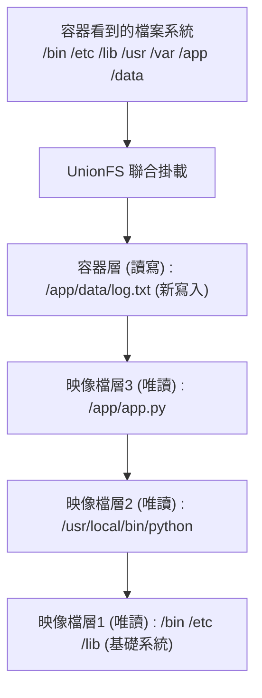
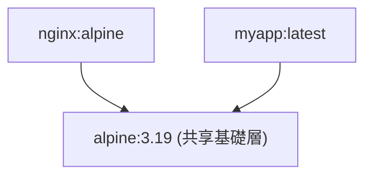
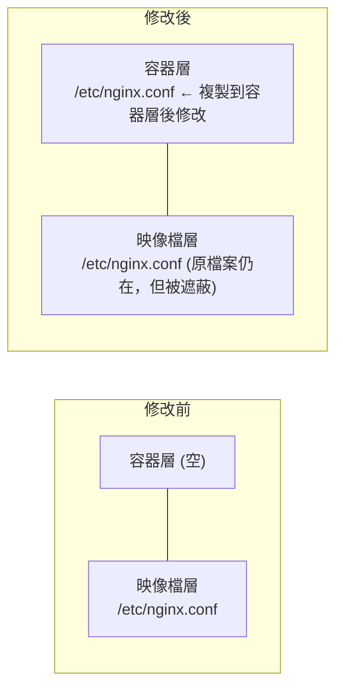
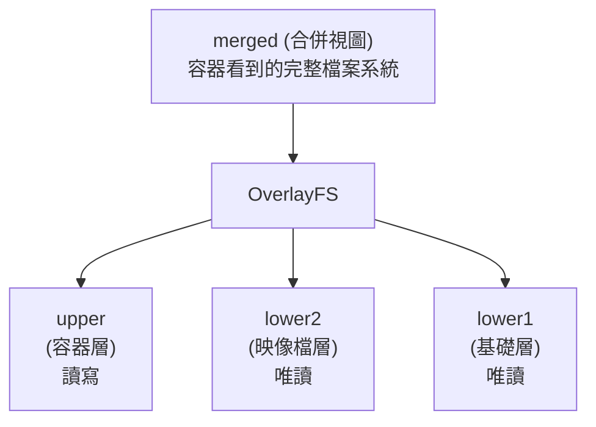

## Union 檔案系統

Union 檔案系統 (UnionFS) 是 Docker 映像檔分層儲存的基礎，它允許將多個目錄掛載為同一個虛擬檔案系統。

### 什麼是 Union 檔案系統

Union 檔案系統 (UnionFS) 是一種 **分層、輕量級** 的檔案系統，它將多個目錄 「聯合」 掛載到同一個虛擬目錄，形成一個統一的檔案系統視圖。

> **核心思想**：將多個唯讀層疊加，最上層可寫，形成完整的檔案系統。


---

### 為什麼 Docker 使用 Union 檔案系統

Docker 選擇 Union 檔案系統作為其儲存驅動，主要基於以下幾個核心優勢。

#### 1. 映像檔分層複用


多個映像檔共享相同的底層，節省磁碟空間。

#### 2. 快速建立

每個 Dockerfile 指令建立一層，只有變化的層需要重建：

```docker
FROM node:22          # 層1：基礎映像檔
COPY package.json ./  # 層2：相依定義
RUN npm install       # 層3：安裝相依
COPY . .              # 層4：應用程式碼
```
程式碼變化時，只需重建層 4，層 1-3 使用快取。

#### 3. 容器啟動快

容器啟動時不需要複製映像檔，只需：

1. 在映像檔層上建立一個薄的可寫層
2. 聯合掛載所有層

---

### Copy-on-Write：寫時複製

當容器修改唯讀層中的檔案時：


**流程**：

1. 從唯讀層讀取檔案
2. 複製到容器的可寫層
3. 在可寫層中修改
4. 後續讀取使用可寫層的版本

---

### Docker 支援的儲存驅動

Docker 的儲存驅動經歷了從早期各式各樣的機制（如 aufs, devicemapper），到被廣泛使用的現代經典 graph driver (`overlay2`)，再到當下（Engine v29.x 及以後）**在新安裝場景中預設啟用的 containerd 映像檔儲存引擎（containerd image store）** 的演進。

| 儲存後端 / 驅動 | 核心特性說明 | 推薦程度 |
|---------|------|---------|
| **containerd image store**|（v29.x 新一代預設後端，新裝預設）基於 containerd 的 snapshotters，原生支援 OCI image index、多架構映像檔與 Attestations 建立溯源中繼資料儲存；啟用 `userns-remap` 時不可用。 | ✅**強烈推薦（現代預設）** |
| **overlay2**|（經典 Graph Driver）傳統架構下的現代 Linux 預設驅動，效能優秀，但在處理複雜溯源中繼資料（索引）時受限。 | ✅**推薦（主要後備）** |
| **aufs** | 早期預設，已從現代 Docker Engine 移除 | 歷史資料 |
| **btrfs**/**zfs** | 使用原生穩定檔案系統快照能力 | 特定場景 |
| **devicemapper** | 塊設備級儲存，已從現代 Docker Engine 移除 | 歷史資料 |
| **vfs** | 不使用 CoW，每層完整複製 | 僅測試 |

#### Classic Graph Drivers 與 Snapshotters 的核心差異

傳統模型（如 `overlay2`）將映像檔拉取解包的過程由 Docker 的 graph drivers 處理。而新的 `containerd image store` 則將這一職責徹底下放給了 `containerd` 自身的 `snapshotters`（底層在 Linux 發行版通常依然利用作業系統的 overlayfs）。這種架構改變帶來了：

1. 本地免拉取查看多平台映像檔 index manifest 與 attestations (SBOM、Provenance)。
2. 允許 Docker 使用 containerd snapshotters 管理映像檔層，便於與現代 OCI 生態能力對齊。它不表示 kubelet/containerd 會自動複用 Docker 本地映像檔；Kubernetes 映像檔分發仍應以 registry、映像檔拉取策略和執行時期設定為準。

#### 查看目前儲存驅動與後端

```bash
## 查看預設儲存驅動
$ docker info | grep "Storage Driver"
Storage Driver: overlay2

## 在 Engine v29.x 中，可以透過如下輸出驗證是否開啟了 containerd 映像檔後端：
$ docker info -f '{{ .DriverStatus }}'
[[driver-type io.containerd.snapshotter.v1]]
```
---

### overlay2 工作原理

在經典 graph driver 體系下，overlay2 仍是 Linux 上的主要推薦驅動；Docker Engine 29 新安裝場景預設走 containerd image store/snapshotter。



- **lowerdir**：唯讀的映像檔層（可以有多個）
- **upperdir**：可寫的容器層
- **workdir**：OverlayFS 的工作目錄
- **merged**：聯合掛載後的視圖

#### 檔案操作行為

| 操作 | 行為 |
|------|------|
| **讀取** | 從上到下查找第一個匹配的檔案 |
| **建立** | 在 upper 層建立 |
| **修改** | 如果在 lower 層，先複製到 upper 層再修改 |
| **刪除** | 在 upper 層建立 whiteout 檔案標記刪除 |

---

### 查看映像檔層

```bash
## 查看映像檔的層資訊

$ docker history nginx:alpine
IMAGE          CREATED       CREATED BY                                      SIZE
a6eb2a334a9f   2 weeks ago   CMD ["nginx" "-g" "daemon off;"]                0B
<missing>      2 weeks ago   STOPSIGNAL SIGQUIT                              0B
<missing>      2 weeks ago   EXPOSE map[80/tcp:{}]                           0B
<missing>      2 weeks ago   ENTRYPOINT ["/docker-entrypoint.sh"]            0B
<missing>      2 weeks ago   COPY 30-tune-worker-processes.sh /docker-ent…   4.62kB
...

## 查看層的儲存位置

$ docker inspect nginx:alpine --format '{{json .GraphDriver.Data}}' | jq
{
  "LowerDir": "/var/lib/docker/overlay2/.../diff:/var/lib/docker/overlay2/.../diff",
  "MergedDir": "/var/lib/docker/overlay2/.../merged",
  "UpperDir": "/var/lib/docker/overlay2/.../diff",
  "WorkDir": "/var/lib/docker/overlay2/.../work"
}
```
---

### 最佳實踐

為了建立高效、輕量的映像檔，我們在使用 Union 檔案系統時應注意以下幾點。

#### 1. 減少映像檔層數

```docker
## ❌ 每條命令建立一層

RUN apt-get update
RUN apt-get install -y nginx
RUN rm -rf /var/lib/apt/lists/*

## ✅ 合併為一層

RUN apt-get update && \
    apt-get install -y nginx && \
    rm -rf /var/lib/apt/lists/*
```

#### 2. 避免在容器中寫入大量資料

容器層的寫入效能低於直接寫入。大量資料應使用：

- 資料卷 (Volume)
- 綁定掛載 (Bind Mount)

#### 3. 使用 .dockerignore

排除不需要的檔案可以：

- 減小建立上下文
- 避免建立不必要的層

---
